::: {.cell}

```{.r .cell-code}
# set params and load target contents
targets::tar_load_globals()
targets::tar_load_everything()

# set custom ggplot2 theme
theme_set(theme_custom())

# resolve namespace conflicts
conflict_prefer("filter", "dplyr")
conflict_prefer("select", "dplyr")
```
:::


# Questionnaires


::: {.cell}

```{.r .cell-code}
pool <- multilex::pool %>% 
    drop_na(cognate)
n_categories <- distinct(pool, category) %>% nrow()
n_items <- length(unique(pool$item))
n_item_language <- count(pool, language) %>% pull(n) %>% set_names(c("catalan", "spanish"))
n_item_cognate <- count(pool, language, cognate) %>% 
    pull(n) %>% 
    set_names(c("catalan-cognate", "catalan-noncognate", "spanish-cognate", "spanish-noncognate"))
```
:::


The questionnaire was implemented on-line using the formR platform [@arslan2020formr], and was structured in three blocks: a (1) language questionnaire, a (2) demographic survey, and a (3) Catalan and a Spanish vocabulary checklists. Vocabulary checklists followed a similar structure as the Oxford Communicative Developmental Inventory [@hamilton2000infant] and consisted in two lists of words: one in Catalan and one in Spanish. The Catalan inventory contained 777 items (196 cognates, 581 non-cognates) and the Spanish inventory contained 782 (197 cognates, 585 non-cognates). Items in one language were translation equivalents of the items in the other language (e.g., whenever *gos* [dog] was included in the Catalan inventory, the word *perro* was included in the Spanish inventory), roughly following a one-to-one mapping. When there were two acceptable translation equivalents for a given word, we included both in separate items (e.g., Catalan *acabar* [*to finish*] and Spanish *acabar* and *terminar*), or merged them into a single items (e.g., Spanish *mono* [*monkey*] and Catalan *mono/mico*. We included items from a diverse sample of 26 semantic/functional categories (see Appendix 1). For the analyses included in this study, we excluded items from the adverbs, auxiliary words, connectives, interjections and games and routines categories, so that only data from content words (nouns, adjectives, and verbs) were used.


For each word in the vocabulary checklists, we asked parents to report whether their child was able to understand it, understand *and* say it, or did not understand or say it (checked out by default). Some families filled a long version of the vocabulary checklists (800 translation equivalents; 800 items in Catalan, 800 items in Spanish), while others filled a shorter version (~400 translation equivalents, ~400 items in Catalan, ~400 items in Spanish). These last families were randomly allocated into one of four different subsets of the complete list of items. These lists were carefully designed so that each contained a representative subsample of the items from the complete list. Semantic/functional categories with less than 16 items--thus resulting in less than four items after dividing it in four lists--were not divided in the short version of the questionnaire: all of their items were included in the four lists. Another subset of items that were part of the trial lists of some experiments in the lab were also included in all versions. Table 2 in Appendix 1 shows the distribution of items across questionnaire versions. We excluded from the analysis multi-word items (e.g., *barrita de cereales* [cereal bar]) and items that included more than one word-form (e.g., *mono / mico*). Table 3 shows the classification of items in cognates and non-cognates and their lexical frequency scores across the four lists of the inventories.

# Items


::: {.cell}

```{.r .cell-code}
items <- left_join(items, select(multilex_data$pool, te, item, language, class, category))

items %>%
    unnest(list) %>% 
    group_by(language, list) %>% 
    summarise_at(
        vars(freq, n_phon, lv), 
        lst(n = ~sum(!is.na(.)), mean, sd, min, max)
    ) %>% 
    select(-c(n_phon_n, lv_n)) %>% 
    rename(n = freq_n) %>% 
    gt(groupname_col = "language") %>% 
    fmt_number(matches("freq_|n_phon_mean|n_phon_sd")) %>% 
    fmt_percent(matches("lv_")) %>% 
    tab_spanner("Frequency (Zipf)", columns = starts_with("freq_")) %>% 
    tab_spanner("# Phonemes", columns = starts_with("n_phon_")) %>% 
    tab_spanner("Levenshtein", columns = starts_with("lv_")) %>% 
    cols_merge_range(col_begin = "freq_min", col_end = "freq_max") %>% 
    cols_merge_range(col_begin = "n_phon_min", col_end = "n_phon_max") %>% 
    cols_merge_range(col_begin = "lv_min", col_end = "lv_max") %>% 
    cols_label(
        list = "",
        n = md("*N*"),
        freq_mean = md("Mean"),
        freq_sd = md("*SD*"),
        freq_min = md("Range"),
        n_phon_mean = md("Mean"),
        n_phon_sd = md("*SD*"),
        n_phon_min = md("Range"),
        lv_mean = md("Mean"),
        lv_sd = md("*SD*"),
        lv_min = md("Range")
    ) %>% 
    tab_style(
        cell_text(style = "italic"),
        cells_column_labels(everything())
    ) %>% 
    tab_style(
        cell_text(weight = "bold"),
        cells_column_spanners(everything())
    )
```

::: {.cell-output-display}
```{=html}
<style>html {
  font-family: -apple-system, BlinkMacSystemFont, 'Segoe UI', Roboto, Oxygen, Ubuntu, Cantarell, 'Helvetica Neue', 'Fira Sans', 'Droid Sans', Arial, sans-serif;
}

#whawrqqszs .gt_table {
  display: table;
  border-collapse: collapse;
  margin-left: auto;
  margin-right: auto;
  color: #333333;
  font-size: 16px;
  font-weight: normal;
  font-style: normal;
  background-color: #FFFFFF;
  width: auto;
  border-top-style: solid;
  border-top-width: 2px;
  border-top-color: #A8A8A8;
  border-right-style: none;
  border-right-width: 2px;
  border-right-color: #D3D3D3;
  border-bottom-style: solid;
  border-bottom-width: 2px;
  border-bottom-color: #A8A8A8;
  border-left-style: none;
  border-left-width: 2px;
  border-left-color: #D3D3D3;
}

#whawrqqszs .gt_heading {
  background-color: #FFFFFF;
  text-align: center;
  border-bottom-color: #FFFFFF;
  border-left-style: none;
  border-left-width: 1px;
  border-left-color: #D3D3D3;
  border-right-style: none;
  border-right-width: 1px;
  border-right-color: #D3D3D3;
}

#whawrqqszs .gt_title {
  color: #333333;
  font-size: 125%;
  font-weight: initial;
  padding-top: 4px;
  padding-bottom: 4px;
  border-bottom-color: #FFFFFF;
  border-bottom-width: 0;
}

#whawrqqszs .gt_subtitle {
  color: #333333;
  font-size: 85%;
  font-weight: initial;
  padding-top: 0;
  padding-bottom: 4px;
  border-top-color: #FFFFFF;
  border-top-width: 0;
}

#whawrqqszs .gt_bottom_border {
  border-bottom-style: solid;
  border-bottom-width: 2px;
  border-bottom-color: #D3D3D3;
}

#whawrqqszs .gt_col_headings {
  border-top-style: solid;
  border-top-width: 2px;
  border-top-color: #D3D3D3;
  border-bottom-style: solid;
  border-bottom-width: 2px;
  border-bottom-color: #D3D3D3;
  border-left-style: none;
  border-left-width: 1px;
  border-left-color: #D3D3D3;
  border-right-style: none;
  border-right-width: 1px;
  border-right-color: #D3D3D3;
}

#whawrqqszs .gt_col_heading {
  color: #333333;
  background-color: #FFFFFF;
  font-size: 100%;
  font-weight: normal;
  text-transform: inherit;
  border-left-style: none;
  border-left-width: 1px;
  border-left-color: #D3D3D3;
  border-right-style: none;
  border-right-width: 1px;
  border-right-color: #D3D3D3;
  vertical-align: bottom;
  padding-top: 5px;
  padding-bottom: 6px;
  padding-left: 5px;
  padding-right: 5px;
  overflow-x: hidden;
}

#whawrqqszs .gt_column_spanner_outer {
  color: #333333;
  background-color: #FFFFFF;
  font-size: 100%;
  font-weight: normal;
  text-transform: inherit;
  padding-top: 0;
  padding-bottom: 0;
  padding-left: 4px;
  padding-right: 4px;
}

#whawrqqszs .gt_column_spanner_outer:first-child {
  padding-left: 0;
}

#whawrqqszs .gt_column_spanner_outer:last-child {
  padding-right: 0;
}

#whawrqqszs .gt_column_spanner {
  border-bottom-style: solid;
  border-bottom-width: 2px;
  border-bottom-color: #D3D3D3;
  vertical-align: bottom;
  padding-top: 5px;
  padding-bottom: 6px;
  overflow-x: hidden;
  display: inline-block;
  width: 100%;
}

#whawrqqszs .gt_group_heading {
  padding: 8px;
  color: #333333;
  background-color: #FFFFFF;
  font-size: 100%;
  font-weight: initial;
  text-transform: inherit;
  border-top-style: solid;
  border-top-width: 2px;
  border-top-color: #D3D3D3;
  border-bottom-style: solid;
  border-bottom-width: 2px;
  border-bottom-color: #D3D3D3;
  border-left-style: none;
  border-left-width: 1px;
  border-left-color: #D3D3D3;
  border-right-style: none;
  border-right-width: 1px;
  border-right-color: #D3D3D3;
  vertical-align: middle;
}

#whawrqqszs .gt_empty_group_heading {
  padding: 0.5px;
  color: #333333;
  background-color: #FFFFFF;
  font-size: 100%;
  font-weight: initial;
  border-top-style: solid;
  border-top-width: 2px;
  border-top-color: #D3D3D3;
  border-bottom-style: solid;
  border-bottom-width: 2px;
  border-bottom-color: #D3D3D3;
  vertical-align: middle;
}

#whawrqqszs .gt_from_md > :first-child {
  margin-top: 0;
}

#whawrqqszs .gt_from_md > :last-child {
  margin-bottom: 0;
}

#whawrqqszs .gt_row {
  padding-top: 8px;
  padding-bottom: 8px;
  padding-left: 5px;
  padding-right: 5px;
  margin: 10px;
  border-top-style: solid;
  border-top-width: 1px;
  border-top-color: #D3D3D3;
  border-left-style: none;
  border-left-width: 1px;
  border-left-color: #D3D3D3;
  border-right-style: none;
  border-right-width: 1px;
  border-right-color: #D3D3D3;
  vertical-align: middle;
  overflow-x: hidden;
}

#whawrqqszs .gt_stub {
  color: #333333;
  background-color: #FFFFFF;
  font-size: 100%;
  font-weight: initial;
  text-transform: inherit;
  border-right-style: solid;
  border-right-width: 2px;
  border-right-color: #D3D3D3;
  padding-left: 12px;
}

#whawrqqszs .gt_summary_row {
  color: #333333;
  background-color: #FFFFFF;
  text-transform: inherit;
  padding-top: 8px;
  padding-bottom: 8px;
  padding-left: 5px;
  padding-right: 5px;
}

#whawrqqszs .gt_first_summary_row {
  padding-top: 8px;
  padding-bottom: 8px;
  padding-left: 5px;
  padding-right: 5px;
  border-top-style: solid;
  border-top-width: 2px;
  border-top-color: #D3D3D3;
}

#whawrqqszs .gt_grand_summary_row {
  color: #333333;
  background-color: #FFFFFF;
  text-transform: inherit;
  padding-top: 8px;
  padding-bottom: 8px;
  padding-left: 5px;
  padding-right: 5px;
}

#whawrqqszs .gt_first_grand_summary_row {
  padding-top: 8px;
  padding-bottom: 8px;
  padding-left: 5px;
  padding-right: 5px;
  border-top-style: double;
  border-top-width: 6px;
  border-top-color: #D3D3D3;
}

#whawrqqszs .gt_striped {
  background-color: rgba(128, 128, 128, 0.05);
}

#whawrqqszs .gt_table_body {
  border-top-style: solid;
  border-top-width: 2px;
  border-top-color: #D3D3D3;
  border-bottom-style: solid;
  border-bottom-width: 2px;
  border-bottom-color: #D3D3D3;
}

#whawrqqszs .gt_footnotes {
  color: #333333;
  background-color: #FFFFFF;
  border-bottom-style: none;
  border-bottom-width: 2px;
  border-bottom-color: #D3D3D3;
  border-left-style: none;
  border-left-width: 2px;
  border-left-color: #D3D3D3;
  border-right-style: none;
  border-right-width: 2px;
  border-right-color: #D3D3D3;
}

#whawrqqszs .gt_footnote {
  margin: 0px;
  font-size: 90%;
  padding: 4px;
}

#whawrqqszs .gt_sourcenotes {
  color: #333333;
  background-color: #FFFFFF;
  border-bottom-style: none;
  border-bottom-width: 2px;
  border-bottom-color: #D3D3D3;
  border-left-style: none;
  border-left-width: 2px;
  border-left-color: #D3D3D3;
  border-right-style: none;
  border-right-width: 2px;
  border-right-color: #D3D3D3;
}

#whawrqqszs .gt_sourcenote {
  font-size: 90%;
  padding: 4px;
}

#whawrqqszs .gt_left {
  text-align: left;
}

#whawrqqszs .gt_center {
  text-align: center;
}

#whawrqqszs .gt_right {
  text-align: right;
  font-variant-numeric: tabular-nums;
}

#whawrqqszs .gt_font_normal {
  font-weight: normal;
}

#whawrqqszs .gt_font_bold {
  font-weight: bold;
}

#whawrqqszs .gt_font_italic {
  font-style: italic;
}

#whawrqqszs .gt_super {
  font-size: 65%;
}

#whawrqqszs .gt_footnote_marks {
  font-style: italic;
  font-size: 65%;
}
</style>
<div id="whawrqqszs" style="overflow-x:auto;overflow-y:auto;width:auto;height:auto;"><table class="gt_table">
  
  <thead class="gt_col_headings">
    <tr>
      <th class="gt_col_heading gt_center gt_columns_bottom_border" rowspan="2" colspan="1" style="font-style: italic;"></th>
      <th class="gt_col_heading gt_center gt_columns_bottom_border" rowspan="2" colspan="1" style="font-style: italic;"><em>N</em></th>
      <th class="gt_center gt_columns_top_border gt_column_spanner_outer" rowspan="1" colspan="3" style="font-weight: bold;">
        <span class="gt_column_spanner">Frequency (Zipf)</span>
      </th>
      <th class="gt_center gt_columns_top_border gt_column_spanner_outer" rowspan="1" colspan="3" style="font-weight: bold;">
        <span class="gt_column_spanner"># Phonemes</span>
      </th>
      <th class="gt_center gt_columns_top_border gt_column_spanner_outer" rowspan="1" colspan="3" style="font-weight: bold;">
        <span class="gt_column_spanner">Levenshtein</span>
      </th>
    </tr>
    <tr>
      <th class="gt_col_heading gt_columns_bottom_border gt_center" rowspan="1" colspan="1" style="font-style: italic;">Mean</th>
      <th class="gt_col_heading gt_columns_bottom_border gt_center" rowspan="1" colspan="1" style="font-style: italic;"><em>SD</em></th>
      <th class="gt_col_heading gt_columns_bottom_border gt_center" rowspan="1" colspan="1" style="font-style: italic;">Range</th>
      <th class="gt_col_heading gt_columns_bottom_border gt_center" rowspan="1" colspan="1" style="font-style: italic;">Mean</th>
      <th class="gt_col_heading gt_columns_bottom_border gt_center" rowspan="1" colspan="1" style="font-style: italic;"><em>SD</em></th>
      <th class="gt_col_heading gt_columns_bottom_border gt_center" rowspan="1" colspan="1" style="font-style: italic;">Range</th>
      <th class="gt_col_heading gt_columns_bottom_border gt_center" rowspan="1" colspan="1" style="font-style: italic;">Mean</th>
      <th class="gt_col_heading gt_columns_bottom_border gt_center" rowspan="1" colspan="1" style="font-style: italic;"><em>SD</em></th>
      <th class="gt_col_heading gt_columns_bottom_border gt_center" rowspan="1" colspan="1" style="font-style: italic;">Range</th>
    </tr>
  </thead>
  <tbody class="gt_table_body">
    <tr class="gt_group_heading_row">
      <td colspan="11" class="gt_group_heading">Catalan</td>
    </tr>
    <tr>
      <td class="gt_row gt_left">A</td>
      <td class="gt_row gt_center">277</td>
      <td class="gt_row gt_right">4.39</td>
      <td class="gt_row gt_right">0.63</td>
      <td class="gt_row gt_right">2.61&ndash;6.52</td>
      <td class="gt_row gt_right">5.27</td>
      <td class="gt_row gt_right">1.74</td>
      <td class="gt_row gt_center">2&ndash;14</td>
      <td class="gt_row gt_right">37.40&percnt;</td>
      <td class="gt_row gt_right">26.96&percnt;</td>
      <td class="gt_row gt_right">0.00&percnt;&ndash;100.00&percnt;</td>
    </tr>
    <tr>
      <td class="gt_row gt_left">B</td>
      <td class="gt_row gt_center">273</td>
      <td class="gt_row gt_right">4.39</td>
      <td class="gt_row gt_right">0.69</td>
      <td class="gt_row gt_right">1.90&ndash;6.31</td>
      <td class="gt_row gt_right">5.20</td>
      <td class="gt_row gt_right">1.77</td>
      <td class="gt_row gt_center">2&ndash;14</td>
      <td class="gt_row gt_right">36.09&percnt;</td>
      <td class="gt_row gt_right">24.69&percnt;</td>
      <td class="gt_row gt_right">0.00&percnt;&ndash;100.00&percnt;</td>
    </tr>
    <tr>
      <td class="gt_row gt_left">C</td>
      <td class="gt_row gt_center">270</td>
      <td class="gt_row gt_right">4.36</td>
      <td class="gt_row gt_right">0.65</td>
      <td class="gt_row gt_right">2.49&ndash;6.54</td>
      <td class="gt_row gt_right">5.46</td>
      <td class="gt_row gt_right">1.88</td>
      <td class="gt_row gt_center">2&ndash;14</td>
      <td class="gt_row gt_right">36.51&percnt;</td>
      <td class="gt_row gt_right">26.11&percnt;</td>
      <td class="gt_row gt_right">0.00&percnt;&ndash;100.00&percnt;</td>
    </tr>
    <tr>
      <td class="gt_row gt_left">D</td>
      <td class="gt_row gt_center">265</td>
      <td class="gt_row gt_right">4.37</td>
      <td class="gt_row gt_right">0.60</td>
      <td class="gt_row gt_right">2.10&ndash;6.10</td>
      <td class="gt_row gt_right">5.29</td>
      <td class="gt_row gt_right">1.72</td>
      <td class="gt_row gt_center">2&ndash;14</td>
      <td class="gt_row gt_right">36.58&percnt;</td>
      <td class="gt_row gt_right">26.43&percnt;</td>
      <td class="gt_row gt_right">0.00&percnt;&ndash;100.00&percnt;</td>
    </tr>
    <tr class="gt_group_heading_row">
      <td colspan="11" class="gt_group_heading">Spanish</td>
    </tr>
    <tr>
      <td class="gt_row gt_left">A</td>
      <td class="gt_row gt_center">277</td>
      <td class="gt_row gt_right">4.25</td>
      <td class="gt_row gt_right">0.74</td>
      <td class="gt_row gt_right">2.28&ndash;6.76</td>
      <td class="gt_row gt_right">5.66</td>
      <td class="gt_row gt_right">1.63</td>
      <td class="gt_row gt_center">3&ndash;14</td>
      <td class="gt_row gt_right">37.33&percnt;</td>
      <td class="gt_row gt_right">26.89&percnt;</td>
      <td class="gt_row gt_right">0.00&percnt;&ndash;100.00&percnt;</td>
    </tr>
    <tr>
      <td class="gt_row gt_left">B</td>
      <td class="gt_row gt_center">281</td>
      <td class="gt_row gt_right">4.28</td>
      <td class="gt_row gt_right">0.79</td>
      <td class="gt_row gt_right">2.16&ndash;6.14</td>
      <td class="gt_row gt_right">5.67</td>
      <td class="gt_row gt_right">1.68</td>
      <td class="gt_row gt_center">2&ndash;14</td>
      <td class="gt_row gt_right">36.18&percnt;</td>
      <td class="gt_row gt_right">24.95&percnt;</td>
      <td class="gt_row gt_right">0.00&percnt;&ndash;100.00&percnt;</td>
    </tr>
    <tr>
      <td class="gt_row gt_left">C</td>
      <td class="gt_row gt_center">278</td>
      <td class="gt_row gt_right">4.24</td>
      <td class="gt_row gt_right">0.77</td>
      <td class="gt_row gt_right">1.68&ndash;6.26</td>
      <td class="gt_row gt_right">5.79</td>
      <td class="gt_row gt_right">1.79</td>
      <td class="gt_row gt_center">3&ndash;14</td>
      <td class="gt_row gt_right">36.53&percnt;</td>
      <td class="gt_row gt_right">26.24&percnt;</td>
      <td class="gt_row gt_right">0.00&percnt;&ndash;100.00&percnt;</td>
    </tr>
    <tr>
      <td class="gt_row gt_left">D</td>
      <td class="gt_row gt_center">273</td>
      <td class="gt_row gt_right">4.24</td>
      <td class="gt_row gt_right">0.72</td>
      <td class="gt_row gt_right">1.98&ndash;6.14</td>
      <td class="gt_row gt_right">5.72</td>
      <td class="gt_row gt_right">1.68</td>
      <td class="gt_row gt_center">2&ndash;14</td>
      <td class="gt_row gt_right">36.59&percnt;</td>
      <td class="gt_row gt_right">26.55&percnt;</td>
      <td class="gt_row gt_right">0.00&percnt;&ndash;100.00&percnt;</td>
    </tr>
  </tbody>
  
  
</table></div>
```


Lexical frequencies. Mean, standard error, and 95\% confidence interval of lexical frequencies of items included in the Catalan and Spanish lists, reported separately for identical cognates, non-identical cognates, and non-cognates.
:::
:::


## Lexical frequency


::: {.cell}

```{.r .cell-code}
items %>% 
    ggplot() +
    aes(
        x = freq,
        fill = language,
        colour = language,
        shape = language
    ) +
    stat_slab(
        slab_colour = "white",
        slab_size = 1,
        alpha = 0.5,
    ) +
    stat_pointinterval(
        aes(y = -0.1),
        position = position_dodge(width = 0.1),
        point_size = 3
    ) +
    geom_hline(yintercept = 0, colour = "black", size = 0.5) +
    labs(
        x = "Frequency (Zipf)",
        y = "Probability density",
        fill = "Language",
        shape = "Language",
        colour = "Language"
    ) +
    scale_y_continuous(labels = percent,  limits = c(-0.15, 1), breaks = seq(0, 1, 0.25)) +
    theme(
        legend.position = "top",
        legend.title = element_blank()
    )
```

::: {.cell-output-display}
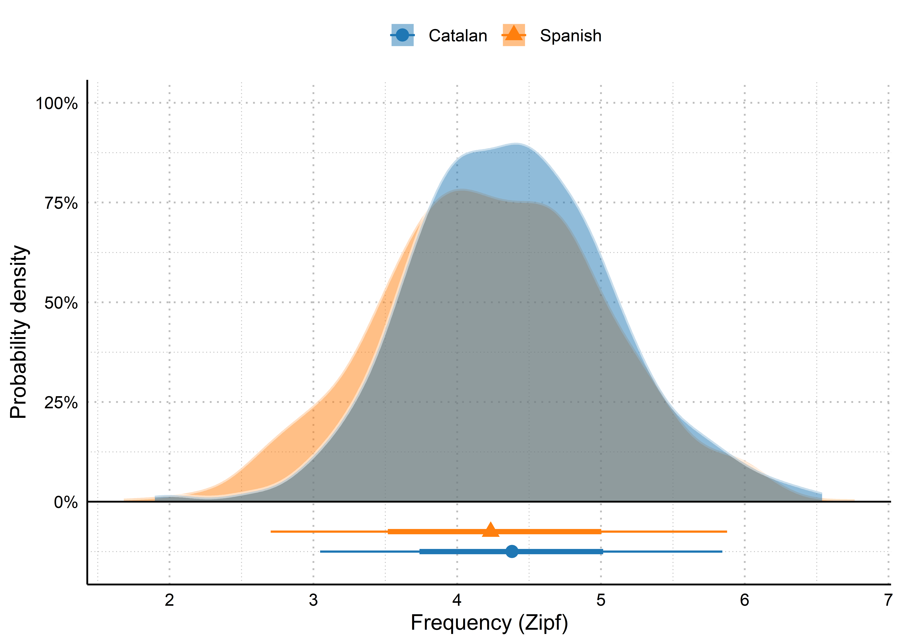{width=3500}
:::
:::


## # Phonemes


::: {.cell}

```{.r .cell-code}
items %>%
    count(language, n_phon) %>% 
    mutate(prop = n/sum(.$n)) %>% 
    ggplot() +
    aes(
        x = n_phon,
        y = prop,
        fill = language,
        colour = language,
        shape = language
    ) +
    geom_col(
        position = position_dodge(width = 0.95)
    ) +
    geom_hline(yintercept = 0, colour = "black", size = 0.5) +
    labs(
        x = "# Phonemes",
        y = "Probability density",
        fill = "Language",
        shape = "Language",
        colour = "Language"
    ) +
    scale_y_continuous(labels = percent, breaks = seq(0, 1, 0.025)) +
    scale_x_continuous(breaks = seq(0, 20, 1)) +
    theme(
        legend.position = "top",
        axis.ticks.x = element_line(),
        legend.title = element_blank()
    )
```

::: {.cell-output-display}
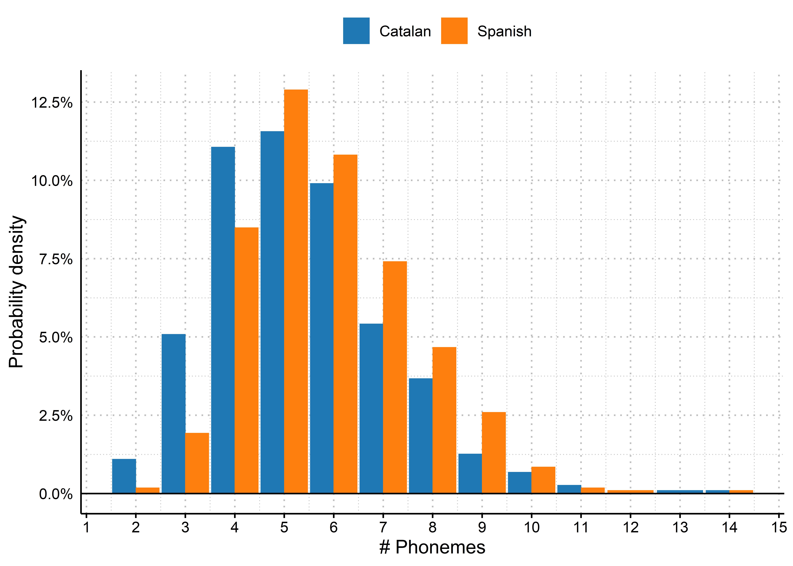{width=3500}
:::
:::


## Levenshtein


::: {.cell}

```{.r .cell-code}
items %>% 
    distinct(te, .keep_all = TRUE) %>% 
    mutate(lv_cut = cut(lv, breaks = seq(0, 1, 0.1), include.lowest = TRUE)) %>% 
    count(lv_cut) %>% 
    mutate(prop = n/sum(.$n)) %>% 
    ggplot() +
    aes(x = lv_cut, y = prop) +
    geom_col(fill = ggsci::pal_d3()(4)[1]) +
    scale_y_continuous(labels = percent, breaks = seq(0, 1, 0.025)) +
    labs(
        x = "Levenshtein",
        y = "Probability density",
    ) +
    theme(
        legend.position = "top"
    )
```

::: {.cell-output-display}
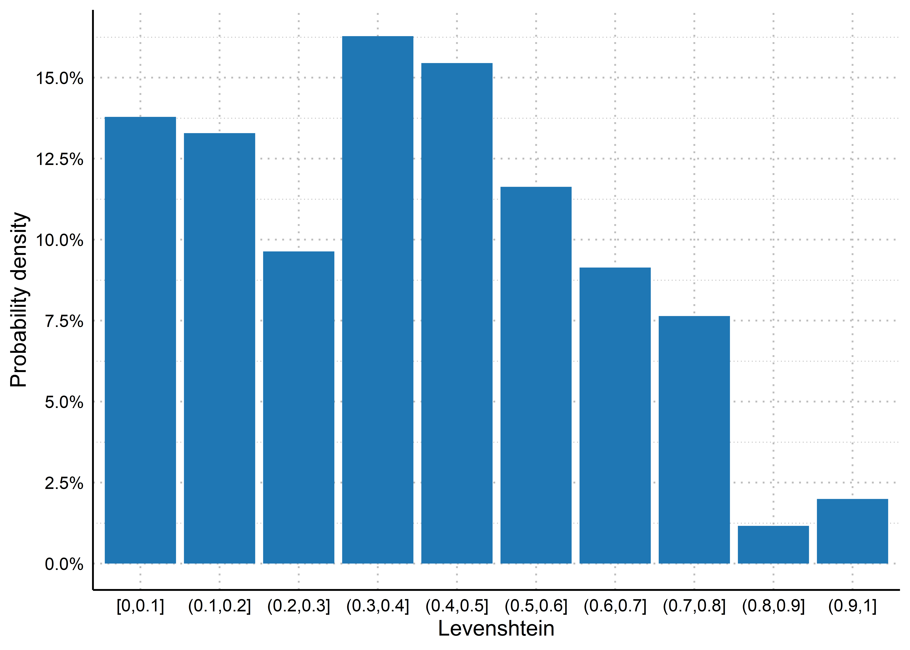{width=3500}
:::
:::


## Frequency by # Phonemes


::: {.cell}

```{.r .cell-code}
items %>% 
    drop_na(freq) %>% 
    ggplot(aes(n_phon, freq, colour = language, fill = language)) +
    facet_wrap(~language) +
    geom_point(size = 1, alpha = 0.25) +
    geom_smooth(method = "lm", formula = "y ~ x") +
    labs(
        x = "# Phonemes", 
        y = "Lexical frequency (Zipf score)\nExtracted from SUBTLEX", 
        colour = "Language", 
        fill = "Language"
    ) +
    scale_x_continuous(breaks = seq(0, 16, 1)) +
    theme(
        legend.position = "none",
        panel.grid.minor = element_blank(),
        panel.grid.major.x = element_blank()
    ) 
```

::: {.cell-output-display}
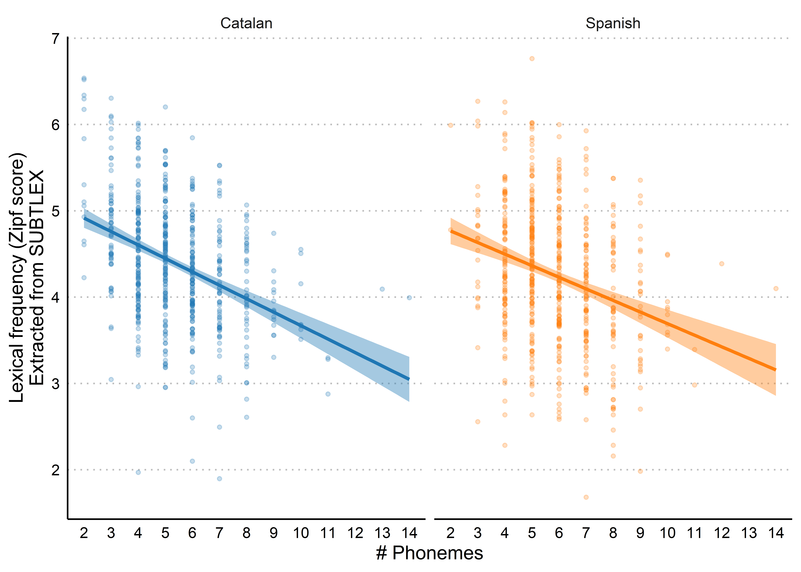{width=3500}
:::
:::


## Frequency by Levenshtein


::: {.cell}

```{.r .cell-code}
items %>% 
    left_join(select(pool, item, language)) %>% 
    drop_na(freq) %>% 
    ggplot(aes(freq, lv, colour = language, fill = language)) +
    facet_wrap(~language) +
    geom_point(size = 1, alpha = 0.5) +
    geom_smooth(method = "lm", formula = "y ~ x") +
    labs(
        y = "Levenshtein similarity", 
        x = "Lexical frequency (Zipf score)\nExtracted from SUBTLEX", 
        colour = "Language", 
        fill = "Language"
    ) +
    scale_y_continuous(labels = percent) +
    theme(
        legend.position = "none",
        panel.grid.major.y = element_blank()
    )
```

::: {.cell-output-display}
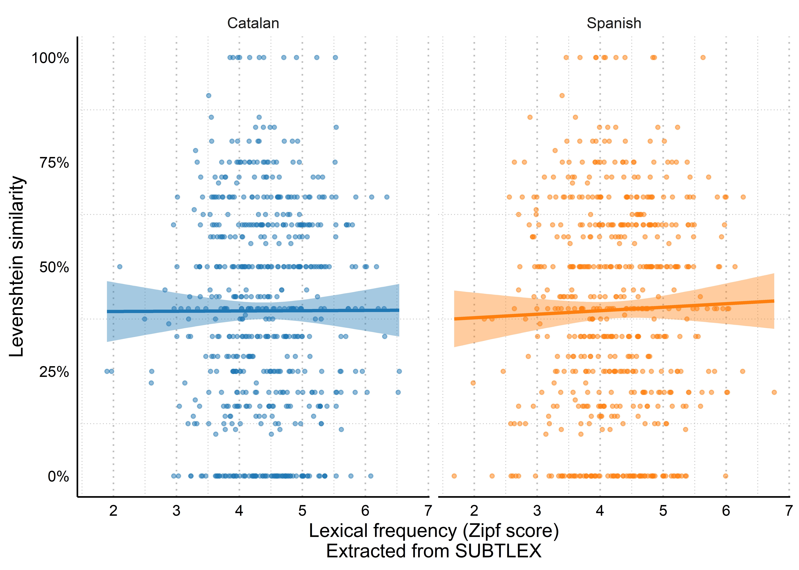{width=3500}
:::
:::


## # Phonemes by Levenshtein


::: {.cell}

```{.r .cell-code}
items %>% 
    left_join(select(pool, item, language)) %>% 
    drop_na(freq) %>% 
    ggplot(aes(n_phon, lv, colour = language, fill = language)) +
    facet_wrap(~language) +
    geom_point(size = 1, alpha = 0.25) +
    geom_smooth(method = "lm", formula = "y ~ x") +
    labs(
        x = "# Phonemes", 
        y = "Levenshtein similarity", 
        colour = "Language", 
        fill = "Language"
    ) +
    scale_y_continuous(labels = percent) +
    scale_x_continuous(breaks = seq(0, 16, 1)) +
    theme(
        legend.position = "none",
        panel.grid.minor = element_blank(),
        panel.grid.major.x = element_blank()
    ) 
```

::: {.cell-output-display}
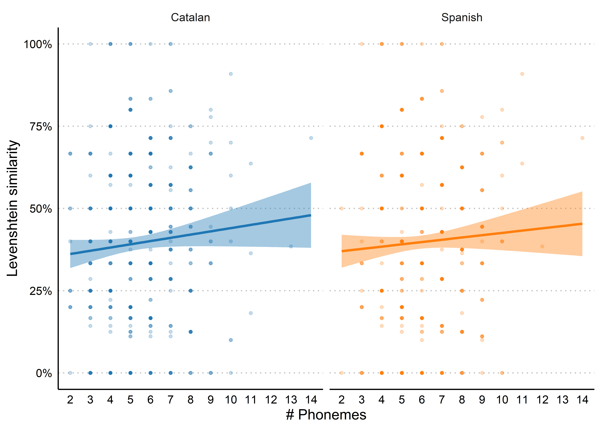{width=3500}
:::
:::


# Participants


::: {.cell}

```{.r .cell-code}
participants <- left_join(
    participants, 
    select(multilex_data$logs, id, time, edu_parent, dominant_language = dominance)
) 

participants %>% 
    group_by(time_stamp, dominant_language) %>% 
    summarise(n = n(), .groups = "drop") %>% 
    group_by(dominant_language) %>% 
    mutate(n = cumsum(n)) %>% 
    ggplot(aes(time_stamp, n, colour = dominant_language, fill = dominant_language)) +
    geom_vline(xintercept = ymd("2020-03-15"), size = 0.5) +
    annotate(geom = "text", y = 350, x = ymd("2020-03-15"), label = "COVID-19 lockdown",
             angle = 90, vjust = 1.5, hjust = 1) +
    geom_line(size = 1) +
    labs(x = "Date", y = "Number of responses", colour = "Dominant language") +
    scale_y_continuous(breaks = seq(0, 400, 50), limits = c(0, 400)) +
    guides(colour = guide_legend(ncol = 2)) +
    theme(
        legend.position = "top",
        legend.title = element_blank(),
        axis.title.x = element_blank(),
    )
```

::: {.cell-output-display}
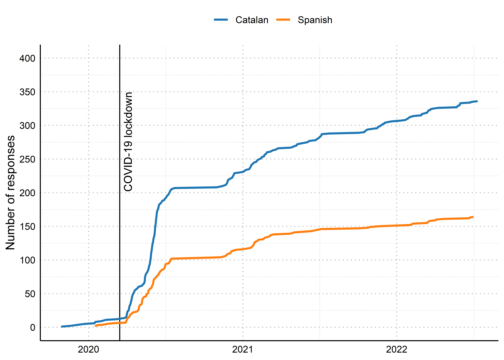{width=3500}
:::
:::


## Age


::: {.cell}

```{.r .cell-code}
participants %>% 
    mutate(age = floor(age)) %>% 
    count(age) %>% 
    ggplot() +
    aes(x = age, y = n) +
    geom_col(fill = pal_d3()(3)[1]) +
    geom_text(aes(label = n), size = 3.5, vjust = -1) +
    labs(
        x = "Age (months)",
        y = "# participants"
    ) +
    scale_x_continuous(breaks = seq(0, 40, 2)) +
    scale_y_continuous(limits = c(0, 55), breaks = seq(0, 55, 10)) +
    theme(
        panel.grid.major.x = element_blank(),
        panel.grid.minor.x = element_blank()
    )
```

::: {.cell-output-display}
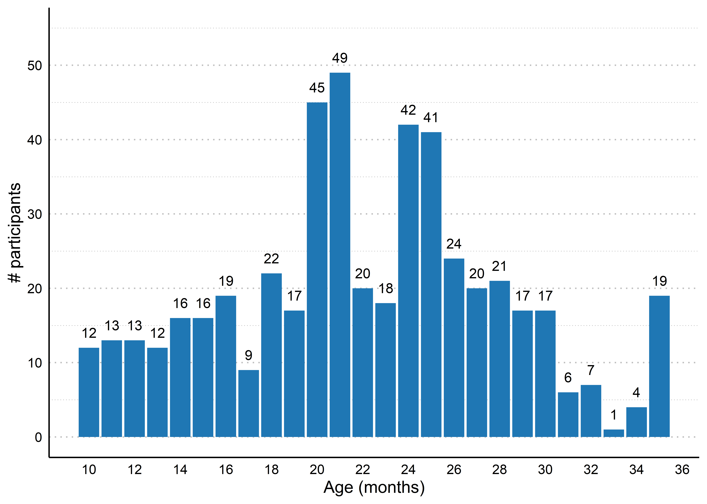{width=3500}
:::
:::


## Language profile


::: {.cell}

```{.r .cell-code}
participants %>% 
    mutate(
        age = round(age),
        id = paste(id, "(", time, ")"),
        rank = rank(doe_catalan)
    ) %>% 
    pivot_longer(
        starts_with("doe_"), 
        names_to = "language",
        values_to = "doe",
        names_prefix = "doe_",
        names_transform = list(language = str_to_sentence)
    ) %>% 
    ggplot() +
    aes(x = doe, y = reorder(id, -rank), fill = language) +
    geom_col(width = 1, position = position_fill(), colour = "white", size = 0.1) +
    geom_vline(xintercept = seq(0, 1, 0.25), colour = "grey") +
    labs(
        x = "Degree of Exposure (DoE)",
        y = "Participant",
        colour = "Language",
        fill = "Language"
    ) +
    scale_x_continuous(labels = percent) +
    theme(
        axis.text.y = element_blank(),
        axis.ticks.y = element_blank(),
        panel.grid.major.y = element_blank(),
        axis.title = element_blank()
    )
```

::: {.cell-output-display}
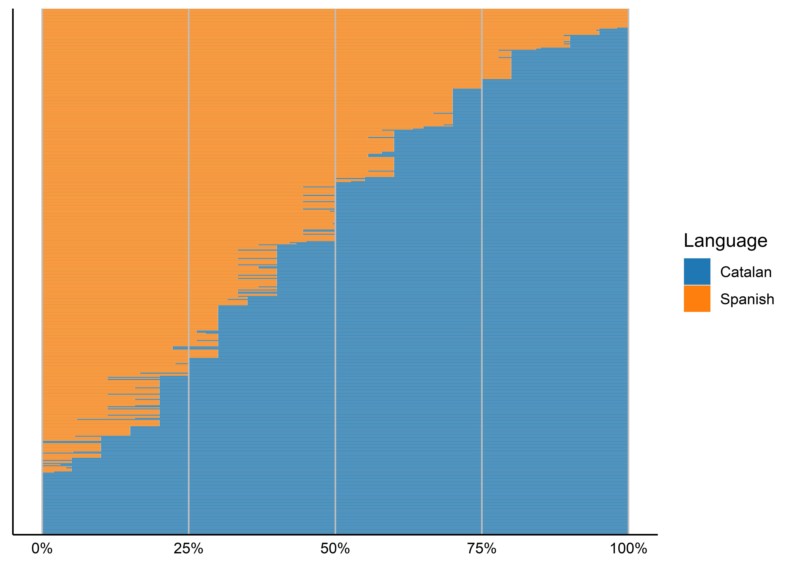{width=3500}
:::
:::


## SES/parental education


::: {.cell}

```{.r .cell-code}
participants %>%
    mutate(
        edu_parent = fct_explicit_na(as.factor(edu_parent)),
        doe_catalan = cut(doe_catalan, breaks = seq(0, 1, 0.1), include.lowest = TRUE)
    ) %>% 
    count(doe_catalan, edu_parent) %>% 
    right_join(
        expand_grid(
            doe_catalan = levels(.$doe_catalan),
            edu_parent = unique(multilex_data$logs$edu_parent)
        )
    ) %>% 
    rename(total = n) %>% 
    pivot_wider(names_from = edu_parent, values_from = total, values_fill = 0) %>%
    mutate(total = rowSums(cbind(.[,3:8]), na.rm = TRUE)) %>% 
    rename(Total = total) %>% 
    select(-"NA") %>% 
    gt() %>% 
    cols_label(
        doe_catalan = "DoE Catalan"
    ) %>% 
    summary_rows(
        columns = 2:7, 
        fns = list(Total = ~sum(., na.rm = TRUE)),
        formatter = fmt_number,
        decimals = 0
    ) %>% 
    fmt_missing(columns = 3:8, missing_text = "--") %>% 
    tab_spanner("Educational attainment", 3:8) %>% 
    tab_style(
        style = list(cell_borders(weight = px(2), sides = "left", color = "grey50")),
        locations = cells_body(columns = 9, rows = 1:10)
    ) %>% 
    tab_style(
        cell_text(style = "italic"),
        cells_column_labels(columns = 2:7)
    ) %>% 
    tab_style(
        cell_text(weight = "bold"),
        cells_column_labels(columns = c(1, 8))
    ) %>% 
    tab_style(
        cell_text(weight = "bold"),
        cells_column_spanners(spanners = "Educational attainment")
    )
```

::: {.cell-output-display}
```{=html}
<style>html {
  font-family: -apple-system, BlinkMacSystemFont, 'Segoe UI', Roboto, Oxygen, Ubuntu, Cantarell, 'Helvetica Neue', 'Fira Sans', 'Droid Sans', Arial, sans-serif;
}

#wukhfnyidg .gt_table {
  display: table;
  border-collapse: collapse;
  margin-left: auto;
  margin-right: auto;
  color: #333333;
  font-size: 16px;
  font-weight: normal;
  font-style: normal;
  background-color: #FFFFFF;
  width: auto;
  border-top-style: solid;
  border-top-width: 2px;
  border-top-color: #A8A8A8;
  border-right-style: none;
  border-right-width: 2px;
  border-right-color: #D3D3D3;
  border-bottom-style: solid;
  border-bottom-width: 2px;
  border-bottom-color: #A8A8A8;
  border-left-style: none;
  border-left-width: 2px;
  border-left-color: #D3D3D3;
}

#wukhfnyidg .gt_heading {
  background-color: #FFFFFF;
  text-align: center;
  border-bottom-color: #FFFFFF;
  border-left-style: none;
  border-left-width: 1px;
  border-left-color: #D3D3D3;
  border-right-style: none;
  border-right-width: 1px;
  border-right-color: #D3D3D3;
}

#wukhfnyidg .gt_title {
  color: #333333;
  font-size: 125%;
  font-weight: initial;
  padding-top: 4px;
  padding-bottom: 4px;
  border-bottom-color: #FFFFFF;
  border-bottom-width: 0;
}

#wukhfnyidg .gt_subtitle {
  color: #333333;
  font-size: 85%;
  font-weight: initial;
  padding-top: 0;
  padding-bottom: 4px;
  border-top-color: #FFFFFF;
  border-top-width: 0;
}

#wukhfnyidg .gt_bottom_border {
  border-bottom-style: solid;
  border-bottom-width: 2px;
  border-bottom-color: #D3D3D3;
}

#wukhfnyidg .gt_col_headings {
  border-top-style: solid;
  border-top-width: 2px;
  border-top-color: #D3D3D3;
  border-bottom-style: solid;
  border-bottom-width: 2px;
  border-bottom-color: #D3D3D3;
  border-left-style: none;
  border-left-width: 1px;
  border-left-color: #D3D3D3;
  border-right-style: none;
  border-right-width: 1px;
  border-right-color: #D3D3D3;
}

#wukhfnyidg .gt_col_heading {
  color: #333333;
  background-color: #FFFFFF;
  font-size: 100%;
  font-weight: normal;
  text-transform: inherit;
  border-left-style: none;
  border-left-width: 1px;
  border-left-color: #D3D3D3;
  border-right-style: none;
  border-right-width: 1px;
  border-right-color: #D3D3D3;
  vertical-align: bottom;
  padding-top: 5px;
  padding-bottom: 6px;
  padding-left: 5px;
  padding-right: 5px;
  overflow-x: hidden;
}

#wukhfnyidg .gt_column_spanner_outer {
  color: #333333;
  background-color: #FFFFFF;
  font-size: 100%;
  font-weight: normal;
  text-transform: inherit;
  padding-top: 0;
  padding-bottom: 0;
  padding-left: 4px;
  padding-right: 4px;
}

#wukhfnyidg .gt_column_spanner_outer:first-child {
  padding-left: 0;
}

#wukhfnyidg .gt_column_spanner_outer:last-child {
  padding-right: 0;
}

#wukhfnyidg .gt_column_spanner {
  border-bottom-style: solid;
  border-bottom-width: 2px;
  border-bottom-color: #D3D3D3;
  vertical-align: bottom;
  padding-top: 5px;
  padding-bottom: 6px;
  overflow-x: hidden;
  display: inline-block;
  width: 100%;
}

#wukhfnyidg .gt_group_heading {
  padding: 8px;
  color: #333333;
  background-color: #FFFFFF;
  font-size: 100%;
  font-weight: initial;
  text-transform: inherit;
  border-top-style: solid;
  border-top-width: 2px;
  border-top-color: #D3D3D3;
  border-bottom-style: solid;
  border-bottom-width: 2px;
  border-bottom-color: #D3D3D3;
  border-left-style: none;
  border-left-width: 1px;
  border-left-color: #D3D3D3;
  border-right-style: none;
  border-right-width: 1px;
  border-right-color: #D3D3D3;
  vertical-align: middle;
}

#wukhfnyidg .gt_empty_group_heading {
  padding: 0.5px;
  color: #333333;
  background-color: #FFFFFF;
  font-size: 100%;
  font-weight: initial;
  border-top-style: solid;
  border-top-width: 2px;
  border-top-color: #D3D3D3;
  border-bottom-style: solid;
  border-bottom-width: 2px;
  border-bottom-color: #D3D3D3;
  vertical-align: middle;
}

#wukhfnyidg .gt_from_md > :first-child {
  margin-top: 0;
}

#wukhfnyidg .gt_from_md > :last-child {
  margin-bottom: 0;
}

#wukhfnyidg .gt_row {
  padding-top: 8px;
  padding-bottom: 8px;
  padding-left: 5px;
  padding-right: 5px;
  margin: 10px;
  border-top-style: solid;
  border-top-width: 1px;
  border-top-color: #D3D3D3;
  border-left-style: none;
  border-left-width: 1px;
  border-left-color: #D3D3D3;
  border-right-style: none;
  border-right-width: 1px;
  border-right-color: #D3D3D3;
  vertical-align: middle;
  overflow-x: hidden;
}

#wukhfnyidg .gt_stub {
  color: #333333;
  background-color: #FFFFFF;
  font-size: 100%;
  font-weight: initial;
  text-transform: inherit;
  border-right-style: solid;
  border-right-width: 2px;
  border-right-color: #D3D3D3;
  padding-left: 12px;
}

#wukhfnyidg .gt_summary_row {
  color: #333333;
  background-color: #FFFFFF;
  text-transform: inherit;
  padding-top: 8px;
  padding-bottom: 8px;
  padding-left: 5px;
  padding-right: 5px;
}

#wukhfnyidg .gt_first_summary_row {
  padding-top: 8px;
  padding-bottom: 8px;
  padding-left: 5px;
  padding-right: 5px;
  border-top-style: solid;
  border-top-width: 2px;
  border-top-color: #D3D3D3;
}

#wukhfnyidg .gt_grand_summary_row {
  color: #333333;
  background-color: #FFFFFF;
  text-transform: inherit;
  padding-top: 8px;
  padding-bottom: 8px;
  padding-left: 5px;
  padding-right: 5px;
}

#wukhfnyidg .gt_first_grand_summary_row {
  padding-top: 8px;
  padding-bottom: 8px;
  padding-left: 5px;
  padding-right: 5px;
  border-top-style: double;
  border-top-width: 6px;
  border-top-color: #D3D3D3;
}

#wukhfnyidg .gt_striped {
  background-color: rgba(128, 128, 128, 0.05);
}

#wukhfnyidg .gt_table_body {
  border-top-style: solid;
  border-top-width: 2px;
  border-top-color: #D3D3D3;
  border-bottom-style: solid;
  border-bottom-width: 2px;
  border-bottom-color: #D3D3D3;
}

#wukhfnyidg .gt_footnotes {
  color: #333333;
  background-color: #FFFFFF;
  border-bottom-style: none;
  border-bottom-width: 2px;
  border-bottom-color: #D3D3D3;
  border-left-style: none;
  border-left-width: 2px;
  border-left-color: #D3D3D3;
  border-right-style: none;
  border-right-width: 2px;
  border-right-color: #D3D3D3;
}

#wukhfnyidg .gt_footnote {
  margin: 0px;
  font-size: 90%;
  padding: 4px;
}

#wukhfnyidg .gt_sourcenotes {
  color: #333333;
  background-color: #FFFFFF;
  border-bottom-style: none;
  border-bottom-width: 2px;
  border-bottom-color: #D3D3D3;
  border-left-style: none;
  border-left-width: 2px;
  border-left-color: #D3D3D3;
  border-right-style: none;
  border-right-width: 2px;
  border-right-color: #D3D3D3;
}

#wukhfnyidg .gt_sourcenote {
  font-size: 90%;
  padding: 4px;
}

#wukhfnyidg .gt_left {
  text-align: left;
}

#wukhfnyidg .gt_center {
  text-align: center;
}

#wukhfnyidg .gt_right {
  text-align: right;
  font-variant-numeric: tabular-nums;
}

#wukhfnyidg .gt_font_normal {
  font-weight: normal;
}

#wukhfnyidg .gt_font_bold {
  font-weight: bold;
}

#wukhfnyidg .gt_font_italic {
  font-style: italic;
}

#wukhfnyidg .gt_super {
  font-size: 65%;
}

#wukhfnyidg .gt_footnote_marks {
  font-style: italic;
  font-size: 65%;
}
</style>
<div id="wukhfnyidg" style="overflow-x:auto;overflow-y:auto;width:auto;height:auto;"><table class="gt_table">
  
  <thead class="gt_col_headings">
    <tr>
      <th class="gt_col_heading gt_columns_bottom_border gt_left" rowspan="2" colspan="1"></th>
      <th class="gt_col_heading gt_center gt_columns_bottom_border" rowspan="2" colspan="1" style="font-weight: bold;">DoE Catalan</th>
      <th class="gt_center gt_columns_top_border gt_column_spanner_outer" rowspan="1" colspan="6" style="font-weight: bold;">
        <span class="gt_column_spanner">Educational attainment</span>
      </th>
      <th class="gt_col_heading gt_center gt_columns_bottom_border" rowspan="2" colspan="1" style="font-weight: bold;">Total</th>
    </tr>
    <tr>
      <th class="gt_col_heading gt_columns_bottom_border gt_center" rowspan="1" colspan="1" style="font-style: italic;">Complementary</th>
      <th class="gt_col_heading gt_columns_bottom_border gt_center" rowspan="1" colspan="1" style="font-style: italic;">Vocational</th>
      <th class="gt_col_heading gt_columns_bottom_border gt_center" rowspan="1" colspan="1" style="font-style: italic;">University</th>
      <th class="gt_col_heading gt_columns_bottom_border gt_center" rowspan="1" colspan="1" style="font-style: italic;">Secondary</th>
      <th class="gt_col_heading gt_columns_bottom_border gt_center" rowspan="1" colspan="1" style="font-style: italic;">No education</th>
      <th class="gt_col_heading gt_columns_bottom_border gt_center" rowspan="1" colspan="1" style="font-style: italic;">Primary</th>
    </tr>
  </thead>
  <tbody class="gt_table_body">
    <tr>
      <td class="gt_row gt_left gt_stub"></td>
      <td class="gt_row gt_left">[0,0.1]</td>
      <td class="gt_row gt_center">1</td>
      <td class="gt_row gt_center">12</td>
      <td class="gt_row gt_center">23</td>
      <td class="gt_row gt_center">&ndash;</td>
      <td class="gt_row gt_center">&ndash;</td>
      <td class="gt_row gt_center">&ndash;</td>
      <td class="gt_row gt_right" style="border-left-width: 2px; border-left-style: solid; border-left-color: grey50;">35</td>
    </tr>
    <tr>
      <td class="gt_row gt_left gt_stub"></td>
      <td class="gt_row gt_left">(0.1,0.2]</td>
      <td class="gt_row gt_center">&ndash;</td>
      <td class="gt_row gt_center">7</td>
      <td class="gt_row gt_center">20</td>
      <td class="gt_row gt_center">2</td>
      <td class="gt_row gt_center">&ndash;</td>
      <td class="gt_row gt_center">&ndash;</td>
      <td class="gt_row gt_right" style="border-left-width: 2px; border-left-style: solid; border-left-color: grey50;">29</td>
    </tr>
    <tr>
      <td class="gt_row gt_left gt_stub"></td>
      <td class="gt_row gt_left">(0.2,0.3]</td>
      <td class="gt_row gt_center">&ndash;</td>
      <td class="gt_row gt_center">8</td>
      <td class="gt_row gt_center">35</td>
      <td class="gt_row gt_center">1</td>
      <td class="gt_row gt_center">1</td>
      <td class="gt_row gt_center">&ndash;</td>
      <td class="gt_row gt_right" style="border-left-width: 2px; border-left-style: solid; border-left-color: grey50;">45</td>
    </tr>
    <tr>
      <td class="gt_row gt_left gt_stub"></td>
      <td class="gt_row gt_left">(0.3,0.4]</td>
      <td class="gt_row gt_center">&ndash;</td>
      <td class="gt_row gt_center">11</td>
      <td class="gt_row gt_center">36</td>
      <td class="gt_row gt_center">1</td>
      <td class="gt_row gt_center">&ndash;</td>
      <td class="gt_row gt_center">&ndash;</td>
      <td class="gt_row gt_right" style="border-left-width: 2px; border-left-style: solid; border-left-color: grey50;">48</td>
    </tr>
    <tr>
      <td class="gt_row gt_left gt_stub"></td>
      <td class="gt_row gt_left">(0.4,0.5]</td>
      <td class="gt_row gt_center">1</td>
      <td class="gt_row gt_center">10</td>
      <td class="gt_row gt_center">45</td>
      <td class="gt_row gt_center">2</td>
      <td class="gt_row gt_center">1</td>
      <td class="gt_row gt_center">1</td>
      <td class="gt_row gt_right" style="border-left-width: 2px; border-left-style: solid; border-left-color: grey50;">59</td>
    </tr>
    <tr>
      <td class="gt_row gt_left gt_stub"></td>
      <td class="gt_row gt_left">(0.5,0.6]</td>
      <td class="gt_row gt_center">1</td>
      <td class="gt_row gt_center">7</td>
      <td class="gt_row gt_center">43</td>
      <td class="gt_row gt_center">1</td>
      <td class="gt_row gt_center">&ndash;</td>
      <td class="gt_row gt_center">&ndash;</td>
      <td class="gt_row gt_right" style="border-left-width: 2px; border-left-style: solid; border-left-color: grey50;">51</td>
    </tr>
    <tr>
      <td class="gt_row gt_left gt_stub"></td>
      <td class="gt_row gt_left">(0.6,0.7]</td>
      <td class="gt_row gt_center">&ndash;</td>
      <td class="gt_row gt_center">10</td>
      <td class="gt_row gt_center">48</td>
      <td class="gt_row gt_center">&ndash;</td>
      <td class="gt_row gt_center">&ndash;</td>
      <td class="gt_row gt_center">&ndash;</td>
      <td class="gt_row gt_right" style="border-left-width: 2px; border-left-style: solid; border-left-color: grey50;">58</td>
    </tr>
    <tr>
      <td class="gt_row gt_left gt_stub"></td>
      <td class="gt_row gt_left">(0.7,0.8]</td>
      <td class="gt_row gt_center">&ndash;</td>
      <td class="gt_row gt_center">5</td>
      <td class="gt_row gt_center">59</td>
      <td class="gt_row gt_center">&ndash;</td>
      <td class="gt_row gt_center">&ndash;</td>
      <td class="gt_row gt_center">&ndash;</td>
      <td class="gt_row gt_right" style="border-left-width: 2px; border-left-style: solid; border-left-color: grey50;">64</td>
    </tr>
    <tr>
      <td class="gt_row gt_left gt_stub"></td>
      <td class="gt_row gt_left">(0.8,0.9]</td>
      <td class="gt_row gt_center">2</td>
      <td class="gt_row gt_center">1</td>
      <td class="gt_row gt_center">26</td>
      <td class="gt_row gt_center">&ndash;</td>
      <td class="gt_row gt_center">&ndash;</td>
      <td class="gt_row gt_center">&ndash;</td>
      <td class="gt_row gt_right" style="border-left-width: 2px; border-left-style: solid; border-left-color: grey50;">27</td>
    </tr>
    <tr>
      <td class="gt_row gt_left gt_stub"></td>
      <td class="gt_row gt_left">(0.9,1]</td>
      <td class="gt_row gt_center">1</td>
      <td class="gt_row gt_center">4</td>
      <td class="gt_row gt_center">68</td>
      <td class="gt_row gt_center">&ndash;</td>
      <td class="gt_row gt_center">&ndash;</td>
      <td class="gt_row gt_center">&ndash;</td>
      <td class="gt_row gt_right" style="border-left-width: 2px; border-left-style: solid; border-left-color: grey50;">72</td>
    </tr>
    <tr>
      <td class="gt_row gt_stub gt_right gt_grand_summary_row gt_first_grand_summary_row">Total</td>
      <td class="gt_row gt_left gt_grand_summary_row gt_first_grand_summary_row">&mdash;</td>
      <td class="gt_row gt_center gt_grand_summary_row gt_first_grand_summary_row">6</td>
      <td class="gt_row gt_center gt_grand_summary_row gt_first_grand_summary_row">75</td>
      <td class="gt_row gt_center gt_grand_summary_row gt_first_grand_summary_row">403</td>
      <td class="gt_row gt_center gt_grand_summary_row gt_first_grand_summary_row">7</td>
      <td class="gt_row gt_center gt_grand_summary_row gt_first_grand_summary_row">2</td>
      <td class="gt_row gt_center gt_grand_summary_row gt_first_grand_summary_row">1</td>
      <td class="gt_row gt_right gt_grand_summary_row gt_first_grand_summary_row">&mdash;</td>
    </tr>
  </tbody>
  
  
</table></div>
```
:::
:::


# Data analysis

We initially fitted a null model (`fit_0`) than only included the predictors `age` and `frequency` as nuisance parameters, along with random intercepts by `id` and `item`, and random slopes of `frequency` by `id`, and `age_std` by `item`, and their correlation parameter. We then expanded this model (`fit_1`) to include the main effect of `doe`, and the `doe` by `item` random slope. Finally, we added the main effect `cognate` (`fit_2`), its interaction with `doe` (`doe:cognate`), and  random slopes for `cognate` by `id`.

## Model equation

:::{.column-body-outset}

$$\begin{aligned}
g[\mathrm{Pr}(y_{ij} \le a_s)] = \tau_s - \nu_{ij}
\end{aligned}$$
:::

$s$ is the s-th response category, $a_1 < a_2 < a_3$ are ordered response categories, $\mathrm{Pr}(y_i \le a_3) = 1$ and $\tau_s$ are threshold parameters where $\tau_1 < \tau_2 < \tau_3$.

:::{.column-body-outset}
$$

\begin{aligned}

\nu_{ij} = & \beta_0 +\beta_1\mathrm{Age}_{i} + \beta_2 \mathrm{Freq}_{j} + \beta_3\mathrm{Phon}_{j} + \beta_4\mathrm{Exposure}_{ij} + \beta_5 \mathrm{Levenshtein}_{j} +
\beta_6\mathrm{(Age_{i} \cdot \mathrm{Exposure}_{ij}}) + \beta_7\mathrm{(\mathrm{Age}_{i} \cdot \mathrm{Levenshtein}_{j}}) +  \beta_8\mathrm{(Exposure_{ij} \cdot \mathrm{Levenshtein}_{j}}) + 
\beta_9{(\mathrm{Age}_{i} \cdot \mathrm{Exposure}_{ij} \cdot \mathrm{Levenshtein}_{j}}) +\\

&\theta_{0j}^{(\mathrm{TE})} + \theta_{1j}^{(\mathrm{TE})}\mathrm{Age}_{i} +  \theta_{2j}^{(\mathrm{TE})} \mathrm{Freq}_{j} + \theta_{3j}^{(\mathrm{TE})} \mathrm{Phon}_{j} + \theta_{4j}^{(\mathrm{TE})} \mathrm{Exposure}_{ij} +  \theta_{5j}^{(\mathrm{TE})} (\mathrm{Age}_{i} \cdot \mathrm{Exposure}_{ij}) +\\

&\theta_{0j}^{(\mathrm{ID})} + \theta_{1j}^{(\mathrm{ID})}\mathrm{Age}_{i} +  \theta_{2j}^{(\mathrm{ID})} \mathrm{Freq}_{j} +   \theta_{3j}^{(\mathrm{ID})} \mathrm{Phon}_{j} + \theta_{4j}^{(\mathrm{ID})} \mathrm{Exposure}_{ij} + \theta_{5j}^{(\mathrm{ID})} \mathrm{Levenshtein}_{j} + \theta_{6j}^{(\mathrm{ID})} (\mathrm{Age}_{i} \cdot \mathrm{Exposure}_{ij}) + 
\theta_{7j}^{(\mathrm{ID})} (\mathrm{Age}_{i} \cdot \mathrm{Levenshtein}_{j}) +
\theta_{8j}^{(\mathrm{ID})} (\mathrm{Age}_{i} \cdot \mathrm{Exposure}_{ij} \cdot \mathrm{Levenshtein}_{j})

\end{aligned}

$$
:::

## Model prior

:::{.column-body-outset}
$$\begin{aligned}

\beta_{0} & \sim \mathrm{Normal}(-0.25, 0.1) & [\mbox{Intercept/response category threshold}] \\
\beta_{1} &\sim \mathrm{Normal}(1, 0.1) & [\mbox{Age population-level coefficient}]\\
\beta_{2-9} &\sim \mathrm{Normal}(0, 1) & [\mbox{Rest of population-level coefficients}] \\
\theta_{0-9} & \sim \mathrm{Normal}(1, 0.1) & [\mbox{Group-level coefficient variability}]
\end{aligned}

$$
:::

In addition, we specified a $LKJ$ prior ($\sim LKJ(2)$ for the correlations between group-level coefficients. We implemented the model prior following {brms} syntax as:

```r
c(
prior(normal(-0.25, 0.1), class = "Intercept"),
prior(normal(1, 0.1), class = "sd", group = "te"),
prior(normal(1, 0.1), class = "sd", group = "id"),
prior(lkj(2), class = "cor"),
prior(normal(1, 0.1), class = "b", coef = "age_std"),
prior(normal(0, 0.1), class = "b", coef = "freq_std"),
prior(normal(0, 0.1), class = "b", coef = "n_phon_std"),
prior(normal(0, 0.1), class = "b", coef = "doe_std"),
prior(normal(0, 0.1), class = "b", coef = "lv_std"),
prior(normal(0, 0.1), class = "b", coef = "doe_std:lv_std"),
prior(normal(0, 0.1), class = "b", coef = "age_std:doe_std"),
prior(normal(0, 0.1), class = "b", coef = "age_std:lv_std"),
prior(normal(0, 0.1), class = "b", coef = "age_std:doe_std:lv_std")
)
```

## Model settings

* OS: Windows 10 x64 (build 19042), `r `sessionInfo()$platform`
* R version: R version 4.0.5 (2021-03-31)
* Algorithm: Hamiltonian Montecarlo (No U-turn Sampler, *NUTS*)
* Engine: Stan (brms interface, 2.17.0)
* brms backend: CmdStanR (cmdstanr 0.4.0.9000)
* Chains: 2
* Cores: 2
* Iterations: 2000 (1000)

More details in Appendix: Session Info.

## R code (`brms`)

::: {.panel-tabset}

### Model 0

::: {.cell}

```{.r .cell-code}
print(model_fit_0$formula)
```

::: {.cell-output .cell-output-stdout}
```
response ~ 1 + (1 | id) + (1 | te) 
```
:::
:::

### Model 1

::: {.cell}

```{.r .cell-code}
print(model_fit_1$formula)
```

::: {.cell-output .cell-output-stdout}
```
response ~ age_std + (1 + age_std | id) + (1 + age_std | te) 
```
:::
:::

### Model 2

::: {.cell}

```{.r .cell-code}
print(model_fit_2$formula)
```

::: {.cell-output .cell-output-stdout}
```
response ~ age_std + freq_std + (1 + age_std + freq_std | id) + (1 + age_std | te) 
```
:::
:::

### Model 3

::: {.cell}

```{.r .cell-code}
print(model_fit_3$formula)
```

::: {.cell-output .cell-output-stdout}
```
response ~ age_std + freq_std + n_phon_std + (1 + age_std + freq_std + n_phon_std | id) + (1 + age_std + freq_std + n_phon_std | te) 
```
:::
:::

### Model 4

::: {.cell}

```{.r .cell-code}
print(model_fit_4$formula)
```

::: {.cell-output .cell-output-stdout}
```
response ~ age_std + freq_std + n_phon_std + doe_std + (1 + age_std + freq_std + n_phon_std + doe_std | id) + (1 + age_std + freq_std + n_phon_std + doe_std | te) 
```
:::
:::

### Model 5

::: {.cell}

```{.r .cell-code}
print(model_fit_5$formula)
```

::: {.cell-output .cell-output-stdout}
```
response ~ age_std + freq_std + n_phon_std + doe_std + lv_std + (1 + age_std + freq_std + n_phon_std + doe_std + lv_std | id) + (1 + age_std + freq_std + n_phon_std + doe_std | te) 
```
:::
:::

### Model 6

::: {.cell}

```{.r .cell-code}
print(model_fit_6$formula)
```

::: {.cell-output .cell-output-stdout}
```
response ~ age_std + freq_std + n_phon_std + doe_std * lv_std + (1 + age_std + freq_std + n_phon_std + doe_std * lv_std | id) + (1 + age_std + freq_std + n_phon_std + doe_std | te) 
```
:::
:::

### Model 7

::: {.cell}

```{.r .cell-code}
print(model_fit_7$formula)
```

::: {.cell-output .cell-output-stdout}
```
response ~ age_std + freq_std + n_phon_std + doe_std * lv_std + age_std:(doe_std * lv_std) + (1 + age_std + freq_std + n_phon_std + age_std:(doe_std * lv_std) | id) + (1 + age_std + freq_std + n_phon_std + age_std:doe_std | te) 
```
:::
:::

:::

## Stan code

Stan code generated by `brms::stancode`.

::: {.panel-tabset}

### Model 0

```
// generated with brms 2.16.1
functions {
/* cratio-logit log-PDF for a single response
* Args:
*   y: response category
*   mu: latent mean parameter
*   disc: discrimination parameter
*   thres: ordinal thresholds
* Returns:
*   a scalar to be added to the log posterior
*/
real cratio_logit_lpmf(int y, real mu, real disc, vector thres) {
int nthres = num_elements(thres);
vector[nthres + 1] p;
vector[nthres] q;
int k = 1;
while (k <= min(y, nthres)) {
q[k] = log_inv_logit(disc * (mu - thres[k]));
p[k] = log1m_exp(q[k]);
for (kk in 1:(k - 1)) p[k] = p[k] + q[kk];
k += 1;
}
if (y == nthres + 1) {
p[nthres + 1] = sum(q);
}
return p[y];
}
/* cratio-logit log-PDF for a single response and merged thresholds
* Args:
*   y: response category
*   mu: latent mean parameter
*   disc: discrimination parameter
*   thres: vector of merged ordinal thresholds
*   j: start and end index for the applid threshold within 'thres'
* Returns:
*   a scalar to be added to the log posterior
*/
real cratio_logit_merged_lpmf(int y, real mu, real disc, vector thres, int[] j) {
return cratio_logit_lpmf(y | mu, disc, thres[j[1]:j[2]]);
}
}
data {
int<lower=1> N;  // total number of observations
int Y[N];  // response variable
int<lower=2> nthres;  // number of thresholds
// data for group-level effects of ID 1
int<lower=1> N_1;  // number of grouping levels
int<lower=1> M_1;  // number of coefficients per level
int<lower=1> J_1[N];  // grouping indicator per observation
// group-level predictor values
vector[N] Z_1_1;
// data for group-level effects of ID 2
int<lower=1> N_2;  // number of grouping levels
int<lower=1> M_2;  // number of coefficients per level
int<lower=1> J_2[N];  // grouping indicator per observation
// group-level predictor values
vector[N] Z_2_1;
int prior_only;  // should the likelihood be ignored?
}
transformed data {
}
parameters {
vector[nthres] Intercept;  // temporary thresholds for centered predictors
vector<lower=0>[M_1] sd_1;  // group-level standard deviations
vector[N_1] z_1[M_1];  // standardized group-level effects
vector<lower=0>[M_2] sd_2;  // group-level standard deviations
vector[N_2] z_2[M_2];  // standardized group-level effects
}
transformed parameters {
real<lower=0> disc = 1;  // discrimination parameters
vector[N_1] r_1_1;  // actual group-level effects
vector[N_2] r_2_1;  // actual group-level effects
r_1_1 = (sd_1[1] * (z_1[1]));
r_2_1 = (sd_2[1] * (z_2[1]));
}
model {
// likelihood including constants
if (!prior_only) {
// initialize linear predictor term
vector[N] mu = rep_vector(0.0, N);
for (n in 1:N) {
// add more terms to the linear predictor
mu[n] += r_1_1[J_1[n]] * Z_1_1[n] + r_2_1[J_2[n]] * Z_2_1[n];
}
for (n in 1:N) {
target += cratio_logit_lpmf(Y[n] | mu[n], disc, Intercept);
}
}
// priors including constants
target += normal_lpdf(Intercept | -0.25, 0.1);
target += normal_lpdf(sd_1 | 1, 0.1)
- 1 * normal_lccdf(0 | 1, 0.1);
target += std_normal_lpdf(z_1[1]);
target += normal_lpdf(sd_2 | 1, 0.1)
- 1 * normal_lccdf(0 | 1, 0.1);
target += std_normal_lpdf(z_2[1]);
}
generated quantities {
// compute actual thresholds
vector[nthres] b_Intercept = Intercept;
// additionally sample draws from priors
real prior_Intercept = normal_rng(-0.25,0.1);
real prior_sd_1 = normal_rng(1,0.1);
real prior_sd_2 = normal_rng(1,0.1);
// use rejection sampling for truncated priors
while (prior_sd_1 < 0) {
prior_sd_1 = normal_rng(1,0.1);
}
while (prior_sd_2 < 0) {
prior_sd_2 = normal_rng(1,0.1);
}
}
```

### Model 1

```
// generated with brms 2.16.1
functions {
/* compute correlated group-level effects
* Args: 
*   z: matrix of unscaled group-level effects
*   SD: vector of standard deviation parameters
*   L: cholesky factor correlation matrix
* Returns: 
*   matrix of scaled group-level effects
*/ 
matrix scale_r_cor(matrix z, vector SD, matrix L) {
// r is stored in another dimension order than z
return transpose(diag_pre_multiply(SD, L) * z);
}
/* cratio-logit log-PDF for a single response
* Args:
*   y: response category
*   mu: latent mean parameter
*   disc: discrimination parameter
*   thres: ordinal thresholds
* Returns:
*   a scalar to be added to the log posterior
*/
real cratio_logit_lpmf(int y, real mu, real disc, vector thres) {
int nthres = num_elements(thres);
vector[nthres + 1] p;
vector[nthres] q;
int k = 1;
while (k <= min(y, nthres)) {
q[k] = log_inv_logit(disc * (mu - thres[k]));
p[k] = log1m_exp(q[k]);
for (kk in 1:(k - 1)) p[k] = p[k] + q[kk];
k += 1;
}
if (y == nthres + 1) {
p[nthres + 1] = sum(q);
}
return p[y];
}
/* cratio-logit log-PDF for a single response and merged thresholds
* Args:
*   y: response category
*   mu: latent mean parameter
*   disc: discrimination parameter
*   thres: vector of merged ordinal thresholds
*   j: start and end index for the applid threshold within 'thres'
* Returns:
*   a scalar to be added to the log posterior
*/
real cratio_logit_merged_lpmf(int y, real mu, real disc, vector thres, int[] j) {
return cratio_logit_lpmf(y | mu, disc, thres[j[1]:j[2]]);
}
}
data {
int<lower=1> N;  // total number of observations
int Y[N];  // response variable
int<lower=2> nthres;  // number of thresholds
int<lower=1> K;  // number of population-level effects
matrix[N, K] X;  // population-level design matrix
// data for group-level effects of ID 1
int<lower=1> N_1;  // number of grouping levels
int<lower=1> M_1;  // number of coefficients per level
int<lower=1> J_1[N];  // grouping indicator per observation
// group-level predictor values
vector[N] Z_1_1;
vector[N] Z_1_2;
int<lower=1> NC_1;  // number of group-level correlations
// data for group-level effects of ID 2
int<lower=1> N_2;  // number of grouping levels
int<lower=1> M_2;  // number of coefficients per level
int<lower=1> J_2[N];  // grouping indicator per observation
// group-level predictor values
vector[N] Z_2_1;
vector[N] Z_2_2;
int<lower=1> NC_2;  // number of group-level correlations
int prior_only;  // should the likelihood be ignored?
}
transformed data {
int Kc = K;
matrix[N, Kc] Xc;  // centered version of X
vector[Kc] means_X;  // column means of X before centering
for (i in 1:K) {
means_X[i] = mean(X[, i]);
Xc[, i] = X[, i] - means_X[i];
}
}
parameters {
vector[Kc] b;  // population-level effects
vector[nthres] Intercept;  // temporary thresholds for centered predictors
vector<lower=0>[M_1] sd_1;  // group-level standard deviations
matrix[M_1, N_1] z_1;  // standardized group-level effects
cholesky_factor_corr[M_1] L_1;  // cholesky factor of correlation matrix
vector<lower=0>[M_2] sd_2;  // group-level standard deviations
matrix[M_2, N_2] z_2;  // standardized group-level effects
cholesky_factor_corr[M_2] L_2;  // cholesky factor of correlation matrix
}
transformed parameters {
real<lower=0> disc = 1;  // discrimination parameters
matrix[N_1, M_1] r_1;  // actual group-level effects
// using vectors speeds up indexing in loops
vector[N_1] r_1_1;
vector[N_1] r_1_2;
matrix[N_2, M_2] r_2;  // actual group-level effects
// using vectors speeds up indexing in loops
vector[N_2] r_2_1;
vector[N_2] r_2_2;
// compute actual group-level effects
r_1 = scale_r_cor(z_1, sd_1, L_1);
r_1_1 = r_1[, 1];
r_1_2 = r_1[, 2];
// compute actual group-level effects
r_2 = scale_r_cor(z_2, sd_2, L_2);
r_2_1 = r_2[, 1];
r_2_2 = r_2[, 2];
}
model {
// likelihood including constants
if (!prior_only) {
// initialize linear predictor term
vector[N] mu = Xc * b;
for (n in 1:N) {
// add more terms to the linear predictor
mu[n] += r_1_1[J_1[n]] * Z_1_1[n] + r_1_2[J_1[n]] * Z_1_2[n] + r_2_1[J_2[n]] * Z_2_1[n] + r_2_2[J_2[n]] * Z_2_2[n];
}
for (n in 1:N) {
target += cratio_logit_lpmf(Y[n] | mu[n], disc, Intercept);
}
}
// priors including constants
target += normal_lpdf(b[1] | 1, 0.1);
target += normal_lpdf(Intercept | -0.25, 0.1);
target += normal_lpdf(sd_1 | 1, 0.1)
- 2 * normal_lccdf(0 | 1, 0.1);
target += std_normal_lpdf(to_vector(z_1));
target += lkj_corr_cholesky_lpdf(L_1 | 2);
target += normal_lpdf(sd_2 | 1, 0.1)
- 2 * normal_lccdf(0 | 1, 0.1);
target += std_normal_lpdf(to_vector(z_2));
target += lkj_corr_cholesky_lpdf(L_2 | 2);
}
generated quantities {
// compute actual thresholds
vector[nthres] b_Intercept = Intercept + dot_product(means_X, b);
// compute group-level correlations
corr_matrix[M_1] Cor_1 = multiply_lower_tri_self_transpose(L_1);
vector<lower=-1,upper=1>[NC_1] cor_1;
// compute group-level correlations
corr_matrix[M_2] Cor_2 = multiply_lower_tri_self_transpose(L_2);
vector<lower=-1,upper=1>[NC_2] cor_2;
// additionally sample draws from priors
real prior_b_1 = normal_rng(1,0.1);
real prior_Intercept = normal_rng(-0.25,0.1);
real prior_sd_1 = normal_rng(1,0.1);
real prior_cor_1 = lkj_corr_rng(M_1,2)[1, 2];
real prior_sd_2 = normal_rng(1,0.1);
real prior_cor_2 = lkj_corr_rng(M_2,2)[1, 2];
// extract upper diagonal of correlation matrix
for (k in 1:M_1) {
for (j in 1:(k - 1)) {
cor_1[choose(k - 1, 2) + j] = Cor_1[j, k];
}
}
// extract upper diagonal of correlation matrix
for (k in 1:M_2) {
for (j in 1:(k - 1)) {
cor_2[choose(k - 1, 2) + j] = Cor_2[j, k];
}
}
// use rejection sampling for truncated priors
while (prior_sd_1 < 0) {
prior_sd_1 = normal_rng(1,0.1);
}
while (prior_sd_2 < 0) {
prior_sd_2 = normal_rng(1,0.1);
}
}
```

### Model 2

```
// generated with brms 2.16.1
functions {
/* compute correlated group-level effects
* Args: 
*   z: matrix of unscaled group-level effects
*   SD: vector of standard deviation parameters
*   L: cholesky factor correlation matrix
* Returns: 
*   matrix of scaled group-level effects
*/ 
matrix scale_r_cor(matrix z, vector SD, matrix L) {
// r is stored in another dimension order than z
return transpose(diag_pre_multiply(SD, L) * z);
}
/* cratio-logit log-PDF for a single response
* Args:
*   y: response category
*   mu: latent mean parameter
*   disc: discrimination parameter
*   thres: ordinal thresholds
* Returns:
*   a scalar to be added to the log posterior
*/
real cratio_logit_lpmf(int y, real mu, real disc, vector thres) {
int nthres = num_elements(thres);
vector[nthres + 1] p;
vector[nthres] q;
int k = 1;
while (k <= min(y, nthres)) {
q[k] = log_inv_logit(disc * (mu - thres[k]));
p[k] = log1m_exp(q[k]);
for (kk in 1:(k - 1)) p[k] = p[k] + q[kk];
k += 1;
}
if (y == nthres + 1) {
p[nthres + 1] = sum(q);
}
return p[y];
}
/* cratio-logit log-PDF for a single response and merged thresholds
* Args:
*   y: response category
*   mu: latent mean parameter
*   disc: discrimination parameter
*   thres: vector of merged ordinal thresholds
*   j: start and end index for the applid threshold within 'thres'
* Returns:
*   a scalar to be added to the log posterior
*/
real cratio_logit_merged_lpmf(int y, real mu, real disc, vector thres, int[] j) {
return cratio_logit_lpmf(y | mu, disc, thres[j[1]:j[2]]);
}
}
data {
int<lower=1> N;  // total number of observations
int Y[N];  // response variable
int<lower=2> nthres;  // number of thresholds
int<lower=1> K;  // number of population-level effects
matrix[N, K] X;  // population-level design matrix
// data for group-level effects of ID 1
int<lower=1> N_1;  // number of grouping levels
int<lower=1> M_1;  // number of coefficients per level
int<lower=1> J_1[N];  // grouping indicator per observation
// group-level predictor values
vector[N] Z_1_1;
vector[N] Z_1_2;
vector[N] Z_1_3;
int<lower=1> NC_1;  // number of group-level correlations
// data for group-level effects of ID 2
int<lower=1> N_2;  // number of grouping levels
int<lower=1> M_2;  // number of coefficients per level
int<lower=1> J_2[N];  // grouping indicator per observation
// group-level predictor values
vector[N] Z_2_1;
vector[N] Z_2_2;
int<lower=1> NC_2;  // number of group-level correlations
int prior_only;  // should the likelihood be ignored?
}
transformed data {
int Kc = K;
matrix[N, Kc] Xc;  // centered version of X
vector[Kc] means_X;  // column means of X before centering
for (i in 1:K) {
means_X[i] = mean(X[, i]);
Xc[, i] = X[, i] - means_X[i];
}
}
parameters {
vector[Kc] b;  // population-level effects
vector[nthres] Intercept;  // temporary thresholds for centered predictors
vector<lower=0>[M_1] sd_1;  // group-level standard deviations
matrix[M_1, N_1] z_1;  // standardized group-level effects
cholesky_factor_corr[M_1] L_1;  // cholesky factor of correlation matrix
vector<lower=0>[M_2] sd_2;  // group-level standard deviations
matrix[M_2, N_2] z_2;  // standardized group-level effects
cholesky_factor_corr[M_2] L_2;  // cholesky factor of correlation matrix
}
transformed parameters {
real<lower=0> disc = 1;  // discrimination parameters
matrix[N_1, M_1] r_1;  // actual group-level effects
// using vectors speeds up indexing in loops
vector[N_1] r_1_1;
vector[N_1] r_1_2;
vector[N_1] r_1_3;
matrix[N_2, M_2] r_2;  // actual group-level effects
// using vectors speeds up indexing in loops
vector[N_2] r_2_1;
vector[N_2] r_2_2;
// compute actual group-level effects
r_1 = scale_r_cor(z_1, sd_1, L_1);
r_1_1 = r_1[, 1];
r_1_2 = r_1[, 2];
r_1_3 = r_1[, 3];
// compute actual group-level effects
r_2 = scale_r_cor(z_2, sd_2, L_2);
r_2_1 = r_2[, 1];
r_2_2 = r_2[, 2];
}
model {
// likelihood including constants
if (!prior_only) {
// initialize linear predictor term
vector[N] mu = Xc * b;
for (n in 1:N) {
// add more terms to the linear predictor
mu[n] += r_1_1[J_1[n]] * Z_1_1[n] + r_1_2[J_1[n]] * Z_1_2[n] + r_1_3[J_1[n]] * Z_1_3[n] + r_2_1[J_2[n]] * Z_2_1[n] + r_2_2[J_2[n]] * Z_2_2[n];
}
for (n in 1:N) {
target += cratio_logit_lpmf(Y[n] | mu[n], disc, Intercept);
}
}
// priors including constants
target += normal_lpdf(b[1] | 1, 0.1);
target += normal_lpdf(b[2] | 0, 0.1);
target += normal_lpdf(Intercept | -0.25, 0.1);
target += normal_lpdf(sd_1 | 1, 0.1)
- 3 * normal_lccdf(0 | 1, 0.1);
target += std_normal_lpdf(to_vector(z_1));
target += lkj_corr_cholesky_lpdf(L_1 | 2);
target += normal_lpdf(sd_2 | 1, 0.1)
- 2 * normal_lccdf(0 | 1, 0.1);
target += std_normal_lpdf(to_vector(z_2));
target += lkj_corr_cholesky_lpdf(L_2 | 2);
}
generated quantities {
// compute actual thresholds
vector[nthres] b_Intercept = Intercept + dot_product(means_X, b);
// compute group-level correlations
corr_matrix[M_1] Cor_1 = multiply_lower_tri_self_transpose(L_1);
vector<lower=-1,upper=1>[NC_1] cor_1;
// compute group-level correlations
corr_matrix[M_2] Cor_2 = multiply_lower_tri_self_transpose(L_2);
vector<lower=-1,upper=1>[NC_2] cor_2;
// additionally sample draws from priors
real prior_b_1 = normal_rng(1,0.1);
real prior_b_2 = normal_rng(0,0.1);
real prior_Intercept = normal_rng(-0.25,0.1);
real prior_sd_1 = normal_rng(1,0.1);
real prior_cor_1 = lkj_corr_rng(M_1,2)[1, 2];
real prior_sd_2 = normal_rng(1,0.1);
real prior_cor_2 = lkj_corr_rng(M_2,2)[1, 2];
// extract upper diagonal of correlation matrix
for (k in 1:M_1) {
for (j in 1:(k - 1)) {
cor_1[choose(k - 1, 2) + j] = Cor_1[j, k];
}
}
// extract upper diagonal of correlation matrix
for (k in 1:M_2) {
for (j in 1:(k - 1)) {
cor_2[choose(k - 1, 2) + j] = Cor_2[j, k];
}
}
// use rejection sampling for truncated priors
while (prior_sd_1 < 0) {
prior_sd_1 = normal_rng(1,0.1);
}
while (prior_sd_2 < 0) {
prior_sd_2 = normal_rng(1,0.1);
}
}
```

### Model 3

```
// generated with brms 2.16.1
functions {
/* compute correlated group-level effects
* Args: 
*   z: matrix of unscaled group-level effects
*   SD: vector of standard deviation parameters
*   L: cholesky factor correlation matrix
* Returns: 
*   matrix of scaled group-level effects
*/ 
matrix scale_r_cor(matrix z, vector SD, matrix L) {
// r is stored in another dimension order than z
return transpose(diag_pre_multiply(SD, L) * z);
}
/* cratio-logit log-PDF for a single response
* Args:
*   y: response category
*   mu: latent mean parameter
*   disc: discrimination parameter
*   thres: ordinal thresholds
* Returns:
*   a scalar to be added to the log posterior
*/
real cratio_logit_lpmf(int y, real mu, real disc, vector thres) {
int nthres = num_elements(thres);
vector[nthres + 1] p;
vector[nthres] q;
int k = 1;
while (k <= min(y, nthres)) {
q[k] = log_inv_logit(disc * (mu - thres[k]));
p[k] = log1m_exp(q[k]);
for (kk in 1:(k - 1)) p[k] = p[k] + q[kk];
k += 1;
}
if (y == nthres + 1) {
p[nthres + 1] = sum(q);
}
return p[y];
}
/* cratio-logit log-PDF for a single response and merged thresholds
* Args:
*   y: response category
*   mu: latent mean parameter
*   disc: discrimination parameter
*   thres: vector of merged ordinal thresholds
*   j: start and end index for the applid threshold within 'thres'
* Returns:
*   a scalar to be added to the log posterior
*/
real cratio_logit_merged_lpmf(int y, real mu, real disc, vector thres, int[] j) {
return cratio_logit_lpmf(y | mu, disc, thres[j[1]:j[2]]);
}
}
data {
int<lower=1> N;  // total number of observations
int Y[N];  // response variable
int<lower=2> nthres;  // number of thresholds
int<lower=1> K;  // number of population-level effects
matrix[N, K] X;  // population-level design matrix
// data for group-level effects of ID 1
int<lower=1> N_1;  // number of grouping levels
int<lower=1> M_1;  // number of coefficients per level
int<lower=1> J_1[N];  // grouping indicator per observation
// group-level predictor values
vector[N] Z_1_1;
vector[N] Z_1_2;
vector[N] Z_1_3;
vector[N] Z_1_4;
int<lower=1> NC_1;  // number of group-level correlations
// data for group-level effects of ID 2
int<lower=1> N_2;  // number of grouping levels
int<lower=1> M_2;  // number of coefficients per level
int<lower=1> J_2[N];  // grouping indicator per observation
// group-level predictor values
vector[N] Z_2_1;
vector[N] Z_2_2;
vector[N] Z_2_3;
vector[N] Z_2_4;
int<lower=1> NC_2;  // number of group-level correlations
int prior_only;  // should the likelihood be ignored?
}
transformed data {
int Kc = K;
matrix[N, Kc] Xc;  // centered version of X
vector[Kc] means_X;  // column means of X before centering
for (i in 1:K) {
means_X[i] = mean(X[, i]);
Xc[, i] = X[, i] - means_X[i];
}
}
parameters {
vector[Kc] b;  // population-level effects
vector[nthres] Intercept;  // temporary thresholds for centered predictors
vector<lower=0>[M_1] sd_1;  // group-level standard deviations
matrix[M_1, N_1] z_1;  // standardized group-level effects
cholesky_factor_corr[M_1] L_1;  // cholesky factor of correlation matrix
vector<lower=0>[M_2] sd_2;  // group-level standard deviations
matrix[M_2, N_2] z_2;  // standardized group-level effects
cholesky_factor_corr[M_2] L_2;  // cholesky factor of correlation matrix
}
transformed parameters {
real<lower=0> disc = 1;  // discrimination parameters
matrix[N_1, M_1] r_1;  // actual group-level effects
// using vectors speeds up indexing in loops
vector[N_1] r_1_1;
vector[N_1] r_1_2;
vector[N_1] r_1_3;
vector[N_1] r_1_4;
matrix[N_2, M_2] r_2;  // actual group-level effects
// using vectors speeds up indexing in loops
vector[N_2] r_2_1;
vector[N_2] r_2_2;
vector[N_2] r_2_3;
vector[N_2] r_2_4;
// compute actual group-level effects
r_1 = scale_r_cor(z_1, sd_1, L_1);
r_1_1 = r_1[, 1];
r_1_2 = r_1[, 2];
r_1_3 = r_1[, 3];
r_1_4 = r_1[, 4];
// compute actual group-level effects
r_2 = scale_r_cor(z_2, sd_2, L_2);
r_2_1 = r_2[, 1];
r_2_2 = r_2[, 2];
r_2_3 = r_2[, 3];
r_2_4 = r_2[, 4];
}
model {
// likelihood including constants
if (!prior_only) {
// initialize linear predictor term
vector[N] mu = Xc * b;
for (n in 1:N) {
// add more terms to the linear predictor
mu[n] += r_1_1[J_1[n]] * Z_1_1[n] + r_1_2[J_1[n]] * Z_1_2[n] + r_1_3[J_1[n]] * Z_1_3[n] + r_1_4[J_1[n]] * Z_1_4[n] + r_2_1[J_2[n]] * Z_2_1[n] + r_2_2[J_2[n]] * Z_2_2[n] + r_2_3[J_2[n]] * Z_2_3[n] + r_2_4[J_2[n]] * Z_2_4[n];
}
for (n in 1:N) {
target += cratio_logit_lpmf(Y[n] | mu[n], disc, Intercept);
}
}
// priors including constants
target += normal_lpdf(b[1] | 1, 0.1);
target += normal_lpdf(b[2] | 0, 0.1);
target += normal_lpdf(b[3] | 0, 0.1);
target += normal_lpdf(Intercept | -0.25, 0.1);
target += normal_lpdf(sd_1 | 1, 0.1)
- 4 * normal_lccdf(0 | 1, 0.1);
target += std_normal_lpdf(to_vector(z_1));
target += lkj_corr_cholesky_lpdf(L_1 | 2);
target += normal_lpdf(sd_2 | 1, 0.1)
- 4 * normal_lccdf(0 | 1, 0.1);
target += std_normal_lpdf(to_vector(z_2));
target += lkj_corr_cholesky_lpdf(L_2 | 2);
}
generated quantities {
// compute actual thresholds
vector[nthres] b_Intercept = Intercept + dot_product(means_X, b);
// compute group-level correlations
corr_matrix[M_1] Cor_1 = multiply_lower_tri_self_transpose(L_1);
vector<lower=-1,upper=1>[NC_1] cor_1;
// compute group-level correlations
corr_matrix[M_2] Cor_2 = multiply_lower_tri_self_transpose(L_2);
vector<lower=-1,upper=1>[NC_2] cor_2;
// additionally sample draws from priors
real prior_b_1 = normal_rng(1,0.1);
real prior_b_2 = normal_rng(0,0.1);
real prior_b_3 = normal_rng(0,0.1);
real prior_Intercept = normal_rng(-0.25,0.1);
real prior_sd_1 = normal_rng(1,0.1);
real prior_cor_1 = lkj_corr_rng(M_1,2)[1, 2];
real prior_sd_2 = normal_rng(1,0.1);
real prior_cor_2 = lkj_corr_rng(M_2,2)[1, 2];
// extract upper diagonal of correlation matrix
for (k in 1:M_1) {
for (j in 1:(k - 1)) {
cor_1[choose(k - 1, 2) + j] = Cor_1[j, k];
}
}
// extract upper diagonal of correlation matrix
for (k in 1:M_2) {
for (j in 1:(k - 1)) {
cor_2[choose(k - 1, 2) + j] = Cor_2[j, k];
}
}
// use rejection sampling for truncated priors
while (prior_sd_1 < 0) {
prior_sd_1 = normal_rng(1,0.1);
}
while (prior_sd_2 < 0) {
prior_sd_2 = normal_rng(1,0.1);
}
}

```

### Model 4

```
// generated with brms 2.16.1
functions {
/* compute correlated group-level effects
* Args: 
*   z: matrix of unscaled group-level effects
*   SD: vector of standard deviation parameters
*   L: cholesky factor correlation matrix
* Returns: 
*   matrix of scaled group-level effects
*/ 
matrix scale_r_cor(matrix z, vector SD, matrix L) {
// r is stored in another dimension order than z
return transpose(diag_pre_multiply(SD, L) * z);
}
/* cratio-logit log-PDF for a single response
* Args:
*   y: response category
*   mu: latent mean parameter
*   disc: discrimination parameter
*   thres: ordinal thresholds
* Returns:
*   a scalar to be added to the log posterior
*/
real cratio_logit_lpmf(int y, real mu, real disc, vector thres) {
int nthres = num_elements(thres);
vector[nthres + 1] p;
vector[nthres] q;
int k = 1;
while (k <= min(y, nthres)) {
q[k] = log_inv_logit(disc * (mu - thres[k]));
p[k] = log1m_exp(q[k]);
for (kk in 1:(k - 1)) p[k] = p[k] + q[kk];
k += 1;
}
if (y == nthres + 1) {
p[nthres + 1] = sum(q);
}
return p[y];
}
/* cratio-logit log-PDF for a single response and merged thresholds
* Args:
*   y: response category
*   mu: latent mean parameter
*   disc: discrimination parameter
*   thres: vector of merged ordinal thresholds
*   j: start and end index for the applid threshold within 'thres'
* Returns:
*   a scalar to be added to the log posterior
*/
real cratio_logit_merged_lpmf(int y, real mu, real disc, vector thres, int[] j) {
return cratio_logit_lpmf(y | mu, disc, thres[j[1]:j[2]]);
}
}
data {
int<lower=1> N;  // total number of observations
int Y[N];  // response variable
int<lower=2> nthres;  // number of thresholds
int<lower=1> K;  // number of population-level effects
matrix[N, K] X;  // population-level design matrix
// data for group-level effects of ID 1
int<lower=1> N_1;  // number of grouping levels
int<lower=1> M_1;  // number of coefficients per level
int<lower=1> J_1[N];  // grouping indicator per observation
// group-level predictor values
vector[N] Z_1_1;
vector[N] Z_1_2;
vector[N] Z_1_3;
vector[N] Z_1_4;
vector[N] Z_1_5;
int<lower=1> NC_1;  // number of group-level correlations
// data for group-level effects of ID 2
int<lower=1> N_2;  // number of grouping levels
int<lower=1> M_2;  // number of coefficients per level
int<lower=1> J_2[N];  // grouping indicator per observation
// group-level predictor values
vector[N] Z_2_1;
vector[N] Z_2_2;
vector[N] Z_2_3;
vector[N] Z_2_4;
vector[N] Z_2_5;
int<lower=1> NC_2;  // number of group-level correlations
int prior_only;  // should the likelihood be ignored?
}
transformed data {
int Kc = K;
matrix[N, Kc] Xc;  // centered version of X
vector[Kc] means_X;  // column means of X before centering
for (i in 1:K) {
means_X[i] = mean(X[, i]);
Xc[, i] = X[, i] - means_X[i];
}
}
parameters {
vector[Kc] b;  // population-level effects
vector[nthres] Intercept;  // temporary thresholds for centered predictors
vector<lower=0>[M_1] sd_1;  // group-level standard deviations
matrix[M_1, N_1] z_1;  // standardized group-level effects
cholesky_factor_corr[M_1] L_1;  // cholesky factor of correlation matrix
vector<lower=0>[M_2] sd_2;  // group-level standard deviations
matrix[M_2, N_2] z_2;  // standardized group-level effects
cholesky_factor_corr[M_2] L_2;  // cholesky factor of correlation matrix
}
transformed parameters {
real<lower=0> disc = 1;  // discrimination parameters
matrix[N_1, M_1] r_1;  // actual group-level effects
// using vectors speeds up indexing in loops
vector[N_1] r_1_1;
vector[N_1] r_1_2;
vector[N_1] r_1_3;
vector[N_1] r_1_4;
vector[N_1] r_1_5;
matrix[N_2, M_2] r_2;  // actual group-level effects
// using vectors speeds up indexing in loops
vector[N_2] r_2_1;
vector[N_2] r_2_2;
vector[N_2] r_2_3;
vector[N_2] r_2_4;
vector[N_2] r_2_5;
// compute actual group-level effects
r_1 = scale_r_cor(z_1, sd_1, L_1);
r_1_1 = r_1[, 1];
r_1_2 = r_1[, 2];
r_1_3 = r_1[, 3];
r_1_4 = r_1[, 4];
r_1_5 = r_1[, 5];
// compute actual group-level effects
r_2 = scale_r_cor(z_2, sd_2, L_2);
r_2_1 = r_2[, 1];
r_2_2 = r_2[, 2];
r_2_3 = r_2[, 3];
r_2_4 = r_2[, 4];
r_2_5 = r_2[, 5];
}
model {
// likelihood including constants
if (!prior_only) {
// initialize linear predictor term
vector[N] mu = Xc * b;
for (n in 1:N) {
// add more terms to the linear predictor
mu[n] += r_1_1[J_1[n]] * Z_1_1[n] + r_1_2[J_1[n]] * Z_1_2[n] + r_1_3[J_1[n]] * Z_1_3[n] + r_1_4[J_1[n]] * Z_1_4[n] + r_1_5[J_1[n]] * Z_1_5[n] + r_2_1[J_2[n]] * Z_2_1[n] + r_2_2[J_2[n]] * Z_2_2[n] + r_2_3[J_2[n]] * Z_2_3[n] + r_2_4[J_2[n]] * Z_2_4[n] + r_2_5[J_2[n]] * Z_2_5[n];
}
for (n in 1:N) {
target += cratio_logit_lpmf(Y[n] | mu[n], disc, Intercept);
}
}
// priors including constants
target += normal_lpdf(b[1] | 1, 0.1);
target += normal_lpdf(b[2] | 0, 0.1);
target += normal_lpdf(b[3] | 0, 0.1);
target += normal_lpdf(b[4] | 0, 0.1);
target += normal_lpdf(Intercept | -0.25, 0.1);
target += normal_lpdf(sd_1 | 1, 0.1)
- 5 * normal_lccdf(0 | 1, 0.1);
target += std_normal_lpdf(to_vector(z_1));
target += lkj_corr_cholesky_lpdf(L_1 | 2);
target += normal_lpdf(sd_2 | 1, 0.1)
- 5 * normal_lccdf(0 | 1, 0.1);
target += std_normal_lpdf(to_vector(z_2));
target += lkj_corr_cholesky_lpdf(L_2 | 2);
}
generated quantities {
// compute actual thresholds
vector[nthres] b_Intercept = Intercept + dot_product(means_X, b);
// compute group-level correlations
corr_matrix[M_1] Cor_1 = multiply_lower_tri_self_transpose(L_1);
vector<lower=-1,upper=1>[NC_1] cor_1;
// compute group-level correlations
corr_matrix[M_2] Cor_2 = multiply_lower_tri_self_transpose(L_2);
vector<lower=-1,upper=1>[NC_2] cor_2;
// additionally sample draws from priors
real prior_b_1 = normal_rng(1,0.1);
real prior_b_2 = normal_rng(0,0.1);
real prior_b_3 = normal_rng(0,0.1);
real prior_b_4 = normal_rng(0,0.1);
real prior_Intercept = normal_rng(-0.25,0.1);
real prior_sd_1 = normal_rng(1,0.1);
real prior_cor_1 = lkj_corr_rng(M_1,2)[1, 2];
real prior_sd_2 = normal_rng(1,0.1);
real prior_cor_2 = lkj_corr_rng(M_2,2)[1, 2];
// extract upper diagonal of correlation matrix
for (k in 1:M_1) {
for (j in 1:(k - 1)) {
cor_1[choose(k - 1, 2) + j] = Cor_1[j, k];
}
}
// extract upper diagonal of correlation matrix
for (k in 1:M_2) {
for (j in 1:(k - 1)) {
cor_2[choose(k - 1, 2) + j] = Cor_2[j, k];
}
}
// use rejection sampling for truncated priors
while (prior_sd_1 < 0) {
prior_sd_1 = normal_rng(1,0.1);
}
while (prior_sd_2 < 0) {
prior_sd_2 = normal_rng(1,0.1);
}
}

```

### Model 5

```
// generated with brms 2.16.1
functions {
/* compute correlated group-level effects
* Args: 
*   z: matrix of unscaled group-level effects
*   SD: vector of standard deviation parameters
*   L: cholesky factor correlation matrix
* Returns: 
*   matrix of scaled group-level effects
*/ 
matrix scale_r_cor(matrix z, vector SD, matrix L) {
// r is stored in another dimension order than z
return transpose(diag_pre_multiply(SD, L) * z);
}
/* cratio-logit log-PDF for a single response
* Args:
*   y: response category
*   mu: latent mean parameter
*   disc: discrimination parameter
*   thres: ordinal thresholds
* Returns:
*   a scalar to be added to the log posterior
*/
real cratio_logit_lpmf(int y, real mu, real disc, vector thres) {
int nthres = num_elements(thres);
vector[nthres + 1] p;
vector[nthres] q;
int k = 1;
while (k <= min(y, nthres)) {
q[k] = log_inv_logit(disc * (mu - thres[k]));
p[k] = log1m_exp(q[k]);
for (kk in 1:(k - 1)) p[k] = p[k] + q[kk];
k += 1;
}
if (y == nthres + 1) {
p[nthres + 1] = sum(q);
}
return p[y];
}
/* cratio-logit log-PDF for a single response and merged thresholds
* Args:
*   y: response category
*   mu: latent mean parameter
*   disc: discrimination parameter
*   thres: vector of merged ordinal thresholds
*   j: start and end index for the applid threshold within 'thres'
* Returns:
*   a scalar to be added to the log posterior
*/
real cratio_logit_merged_lpmf(int y, real mu, real disc, vector thres, int[] j) {
return cratio_logit_lpmf(y | mu, disc, thres[j[1]:j[2]]);
}
}
data {
int<lower=1> N;  // total number of observations
int Y[N];  // response variable
int<lower=2> nthres;  // number of thresholds
int<lower=1> K;  // number of population-level effects
matrix[N, K] X;  // population-level design matrix
// data for group-level effects of ID 1
int<lower=1> N_1;  // number of grouping levels
int<lower=1> M_1;  // number of coefficients per level
int<lower=1> J_1[N];  // grouping indicator per observation
// group-level predictor values
vector[N] Z_1_1;
vector[N] Z_1_2;
vector[N] Z_1_3;
vector[N] Z_1_4;
vector[N] Z_1_5;
vector[N] Z_1_6;
int<lower=1> NC_1;  // number of group-level correlations
// data for group-level effects of ID 2
int<lower=1> N_2;  // number of grouping levels
int<lower=1> M_2;  // number of coefficients per level
int<lower=1> J_2[N];  // grouping indicator per observation
// group-level predictor values
vector[N] Z_2_1;
vector[N] Z_2_2;
vector[N] Z_2_3;
vector[N] Z_2_4;
vector[N] Z_2_5;
int<lower=1> NC_2;  // number of group-level correlations
int prior_only;  // should the likelihood be ignored?
}
transformed data {
int Kc = K;
matrix[N, Kc] Xc;  // centered version of X
vector[Kc] means_X;  // column means of X before centering
for (i in 1:K) {
means_X[i] = mean(X[, i]);
Xc[, i] = X[, i] - means_X[i];
}
}
parameters {
vector[Kc] b;  // population-level effects
vector[nthres] Intercept;  // temporary thresholds for centered predictors
vector<lower=0>[M_1] sd_1;  // group-level standard deviations
matrix[M_1, N_1] z_1;  // standardized group-level effects
cholesky_factor_corr[M_1] L_1;  // cholesky factor of correlation matrix
vector<lower=0>[M_2] sd_2;  // group-level standard deviations
matrix[M_2, N_2] z_2;  // standardized group-level effects
cholesky_factor_corr[M_2] L_2;  // cholesky factor of correlation matrix
}
transformed parameters {
real<lower=0> disc = 1;  // discrimination parameters
matrix[N_1, M_1] r_1;  // actual group-level effects
// using vectors speeds up indexing in loops
vector[N_1] r_1_1;
vector[N_1] r_1_2;
vector[N_1] r_1_3;
vector[N_1] r_1_4;
vector[N_1] r_1_5;
vector[N_1] r_1_6;
matrix[N_2, M_2] r_2;  // actual group-level effects
// using vectors speeds up indexing in loops
vector[N_2] r_2_1;
vector[N_2] r_2_2;
vector[N_2] r_2_3;
vector[N_2] r_2_4;
vector[N_2] r_2_5;
// compute actual group-level effects
r_1 = scale_r_cor(z_1, sd_1, L_1);
r_1_1 = r_1[, 1];
r_1_2 = r_1[, 2];
r_1_3 = r_1[, 3];
r_1_4 = r_1[, 4];
r_1_5 = r_1[, 5];
r_1_6 = r_1[, 6];
// compute actual group-level effects
r_2 = scale_r_cor(z_2, sd_2, L_2);
r_2_1 = r_2[, 1];
r_2_2 = r_2[, 2];
r_2_3 = r_2[, 3];
r_2_4 = r_2[, 4];
r_2_5 = r_2[, 5];
}
model {
// likelihood including constants
if (!prior_only) {
// initialize linear predictor term
vector[N] mu = Xc * b;
for (n in 1:N) {
// add more terms to the linear predictor
mu[n] += r_1_1[J_1[n]] * Z_1_1[n] + r_1_2[J_1[n]] * Z_1_2[n] + r_1_3[J_1[n]] * Z_1_3[n] + r_1_4[J_1[n]] * Z_1_4[n] + r_1_5[J_1[n]] * Z_1_5[n] + r_1_6[J_1[n]] * Z_1_6[n] + r_2_1[J_2[n]] * Z_2_1[n] + r_2_2[J_2[n]] * Z_2_2[n] + r_2_3[J_2[n]] * Z_2_3[n] + r_2_4[J_2[n]] * Z_2_4[n] + r_2_5[J_2[n]] * Z_2_5[n];
}
for (n in 1:N) {
target += cratio_logit_lpmf(Y[n] | mu[n], disc, Intercept);
}
}
// priors including constants
target += normal_lpdf(b[1] | 1, 0.1);
target += normal_lpdf(b[2] | 0, 0.1);
target += normal_lpdf(b[3] | 0, 0.1);
target += normal_lpdf(b[4] | 0, 0.1);
target += normal_lpdf(b[5] | 0, 0.1);
target += normal_lpdf(Intercept | -0.25, 0.1);
target += normal_lpdf(sd_1 | 1, 0.1)
- 6 * normal_lccdf(0 | 1, 0.1);
target += std_normal_lpdf(to_vector(z_1));
target += lkj_corr_cholesky_lpdf(L_1 | 2);
target += normal_lpdf(sd_2 | 1, 0.1)
- 5 * normal_lccdf(0 | 1, 0.1);
target += std_normal_lpdf(to_vector(z_2));
target += lkj_corr_cholesky_lpdf(L_2 | 2);
}
generated quantities {
// compute actual thresholds
vector[nthres] b_Intercept = Intercept + dot_product(means_X, b);
// compute group-level correlations
corr_matrix[M_1] Cor_1 = multiply_lower_tri_self_transpose(L_1);
vector<lower=-1,upper=1>[NC_1] cor_1;
// compute group-level correlations
corr_matrix[M_2] Cor_2 = multiply_lower_tri_self_transpose(L_2);
vector<lower=-1,upper=1>[NC_2] cor_2;
// additionally sample draws from priors
real prior_b_1 = normal_rng(1,0.1);
real prior_b_2 = normal_rng(0,0.1);
real prior_b_3 = normal_rng(0,0.1);
real prior_b_4 = normal_rng(0,0.1);
real prior_b_5 = normal_rng(0,0.1);
real prior_Intercept = normal_rng(-0.25,0.1);
real prior_sd_1 = normal_rng(1,0.1);
real prior_cor_1 = lkj_corr_rng(M_1,2)[1, 2];
real prior_sd_2 = normal_rng(1,0.1);
real prior_cor_2 = lkj_corr_rng(M_2,2)[1, 2];
// extract upper diagonal of correlation matrix
for (k in 1:M_1) {
for (j in 1:(k - 1)) {
cor_1[choose(k - 1, 2) + j] = Cor_1[j, k];
}
}
// extract upper diagonal of correlation matrix
for (k in 1:M_2) {
for (j in 1:(k - 1)) {
cor_2[choose(k - 1, 2) + j] = Cor_2[j, k];
}
}
// use rejection sampling for truncated priors
while (prior_sd_1 < 0) {
prior_sd_1 = normal_rng(1,0.1);
}
while (prior_sd_2 < 0) {
prior_sd_2 = normal_rng(1,0.1);
}
}
```

### Model 6

```
// generated with brms 2.16.1
functions {
/* compute correlated group-level effects
* Args: 
*   z: matrix of unscaled group-level effects
*   SD: vector of standard deviation parameters
*   L: cholesky factor correlation matrix
* Returns: 
*   matrix of scaled group-level effects
*/ 
matrix scale_r_cor(matrix z, vector SD, matrix L) {
// r is stored in another dimension order than z
return transpose(diag_pre_multiply(SD, L) * z);
}
/* cratio-logit log-PDF for a single response
* Args:
*   y: response category
*   mu: latent mean parameter
*   disc: discrimination parameter
*   thres: ordinal thresholds
* Returns:
*   a scalar to be added to the log posterior
*/
real cratio_logit_lpmf(int y, real mu, real disc, vector thres) {
int nthres = num_elements(thres);
vector[nthres + 1] p;
vector[nthres] q;
int k = 1;
while (k <= min(y, nthres)) {
q[k] = log_inv_logit(disc * (mu - thres[k]));
p[k] = log1m_exp(q[k]);
for (kk in 1:(k - 1)) p[k] = p[k] + q[kk];
k += 1;
}
if (y == nthres + 1) {
p[nthres + 1] = sum(q);
}
return p[y];
}
/* cratio-logit log-PDF for a single response and merged thresholds
* Args:
*   y: response category
*   mu: latent mean parameter
*   disc: discrimination parameter
*   thres: vector of merged ordinal thresholds
*   j: start and end index for the applid threshold within 'thres'
* Returns:
*   a scalar to be added to the log posterior
*/
real cratio_logit_merged_lpmf(int y, real mu, real disc, vector thres, int[] j) {
return cratio_logit_lpmf(y | mu, disc, thres[j[1]:j[2]]);
}
}
data {
int<lower=1> N;  // total number of observations
int Y[N];  // response variable
int<lower=2> nthres;  // number of thresholds
int<lower=1> K;  // number of population-level effects
matrix[N, K] X;  // population-level design matrix
// data for group-level effects of ID 1
int<lower=1> N_1;  // number of grouping levels
int<lower=1> M_1;  // number of coefficients per level
int<lower=1> J_1[N];  // grouping indicator per observation
// group-level predictor values
vector[N] Z_1_1;
vector[N] Z_1_2;
vector[N] Z_1_3;
vector[N] Z_1_4;
vector[N] Z_1_5;
vector[N] Z_1_6;
vector[N] Z_1_7;
int<lower=1> NC_1;  // number of group-level correlations
// data for group-level effects of ID 2
int<lower=1> N_2;  // number of grouping levels
int<lower=1> M_2;  // number of coefficients per level
int<lower=1> J_2[N];  // grouping indicator per observation
// group-level predictor values
vector[N] Z_2_1;
vector[N] Z_2_2;
vector[N] Z_2_3;
vector[N] Z_2_4;
vector[N] Z_2_5;
int<lower=1> NC_2;  // number of group-level correlations
int prior_only;  // should the likelihood be ignored?
}
transformed data {
int Kc = K;
matrix[N, Kc] Xc;  // centered version of X
vector[Kc] means_X;  // column means of X before centering
for (i in 1:K) {
means_X[i] = mean(X[, i]);
Xc[, i] = X[, i] - means_X[i];
}
}
parameters {
vector[Kc] b;  // population-level effects
vector[nthres] Intercept;  // temporary thresholds for centered predictors
vector<lower=0>[M_1] sd_1;  // group-level standard deviations
matrix[M_1, N_1] z_1;  // standardized group-level effects
cholesky_factor_corr[M_1] L_1;  // cholesky factor of correlation matrix
vector<lower=0>[M_2] sd_2;  // group-level standard deviations
matrix[M_2, N_2] z_2;  // standardized group-level effects
cholesky_factor_corr[M_2] L_2;  // cholesky factor of correlation matrix
}
transformed parameters {
real<lower=0> disc = 1;  // discrimination parameters
matrix[N_1, M_1] r_1;  // actual group-level effects
// using vectors speeds up indexing in loops
vector[N_1] r_1_1;
vector[N_1] r_1_2;
vector[N_1] r_1_3;
vector[N_1] r_1_4;
vector[N_1] r_1_5;
vector[N_1] r_1_6;
vector[N_1] r_1_7;
matrix[N_2, M_2] r_2;  // actual group-level effects
// using vectors speeds up indexing in loops
vector[N_2] r_2_1;
vector[N_2] r_2_2;
vector[N_2] r_2_3;
vector[N_2] r_2_4;
vector[N_2] r_2_5;
// compute actual group-level effects
r_1 = scale_r_cor(z_1, sd_1, L_1);
r_1_1 = r_1[, 1];
r_1_2 = r_1[, 2];
r_1_3 = r_1[, 3];
r_1_4 = r_1[, 4];
r_1_5 = r_1[, 5];
r_1_6 = r_1[, 6];
r_1_7 = r_1[, 7];
// compute actual group-level effects
r_2 = scale_r_cor(z_2, sd_2, L_2);
r_2_1 = r_2[, 1];
r_2_2 = r_2[, 2];
r_2_3 = r_2[, 3];
r_2_4 = r_2[, 4];
r_2_5 = r_2[, 5];
}
model {
// likelihood including constants
if (!prior_only) {
// initialize linear predictor term
vector[N] mu = Xc * b;
for (n in 1:N) {
// add more terms to the linear predictor
mu[n] += r_1_1[J_1[n]] * Z_1_1[n] + r_1_2[J_1[n]] * Z_1_2[n] + r_1_3[J_1[n]] * Z_1_3[n] + r_1_4[J_1[n]] * Z_1_4[n] + r_1_5[J_1[n]] * Z_1_5[n] + r_1_6[J_1[n]] * Z_1_6[n] + r_1_7[J_1[n]] * Z_1_7[n] + r_2_1[J_2[n]] * Z_2_1[n] + r_2_2[J_2[n]] * Z_2_2[n] + r_2_3[J_2[n]] * Z_2_3[n] + r_2_4[J_2[n]] * Z_2_4[n] + r_2_5[J_2[n]] * Z_2_5[n];
}
for (n in 1:N) {
target += cratio_logit_lpmf(Y[n] | mu[n], disc, Intercept);
}
}
// priors including constants
target += normal_lpdf(b[1] | 1, 0.1);
target += normal_lpdf(b[2] | 0, 0.1);
target += normal_lpdf(b[3] | 0, 0.1);
target += normal_lpdf(b[4] | 0, 0.1);
target += normal_lpdf(b[5] | 0, 0.1);
target += normal_lpdf(b[6] | 0, 0.1);
target += normal_lpdf(Intercept | -0.25, 0.1);
target += normal_lpdf(sd_1 | 1, 0.1)
- 7 * normal_lccdf(0 | 1, 0.1);
target += std_normal_lpdf(to_vector(z_1));
target += lkj_corr_cholesky_lpdf(L_1 | 2);
target += normal_lpdf(sd_2 | 1, 0.1)
- 5 * normal_lccdf(0 | 1, 0.1);
target += std_normal_lpdf(to_vector(z_2));
target += lkj_corr_cholesky_lpdf(L_2 | 2);
}
generated quantities {
// compute actual thresholds
vector[nthres] b_Intercept = Intercept + dot_product(means_X, b);
// compute group-level correlations
corr_matrix[M_1] Cor_1 = multiply_lower_tri_self_transpose(L_1);
vector<lower=-1,upper=1>[NC_1] cor_1;
// compute group-level correlations
corr_matrix[M_2] Cor_2 = multiply_lower_tri_self_transpose(L_2);
vector<lower=-1,upper=1>[NC_2] cor_2;
// additionally sample draws from priors
real prior_b_1 = normal_rng(1,0.1);
real prior_b_2 = normal_rng(0,0.1);
real prior_b_3 = normal_rng(0,0.1);
real prior_b_4 = normal_rng(0,0.1);
real prior_b_5 = normal_rng(0,0.1);
real prior_b_6 = normal_rng(0,0.1);
real prior_Intercept = normal_rng(-0.25,0.1);
real prior_sd_1 = normal_rng(1,0.1);
real prior_cor_1 = lkj_corr_rng(M_1,2)[1, 2];
real prior_sd_2 = normal_rng(1,0.1);
real prior_cor_2 = lkj_corr_rng(M_2,2)[1, 2];
// extract upper diagonal of correlation matrix
for (k in 1:M_1) {
for (j in 1:(k - 1)) {
cor_1[choose(k - 1, 2) + j] = Cor_1[j, k];
}
}
// extract upper diagonal of correlation matrix
for (k in 1:M_2) {
for (j in 1:(k - 1)) {
cor_2[choose(k - 1, 2) + j] = Cor_2[j, k];
}
}
// use rejection sampling for truncated priors
while (prior_sd_1 < 0) {
prior_sd_1 = normal_rng(1,0.1);
}
while (prior_sd_2 < 0) {
prior_sd_2 = normal_rng(1,0.1);
}
}
```


### Model 7

```
// generated with brms 2.16.1
functions {
/* compute correlated group-level effects
* Args: 
*   z: matrix of unscaled group-level effects
*   SD: vector of standard deviation parameters
*   L: cholesky factor correlation matrix
* Returns: 
*   matrix of scaled group-level effects
*/ 
matrix scale_r_cor(matrix z, vector SD, matrix L) {
// r is stored in another dimension order than z
return transpose(diag_pre_multiply(SD, L) * z);
}
/* cratio-logit log-PDF for a single response
* Args:
*   y: response category
*   mu: latent mean parameter
*   disc: discrimination parameter
*   thres: ordinal thresholds
* Returns:
*   a scalar to be added to the log posterior
*/
real cratio_logit_lpmf(int y, real mu, real disc, vector thres) {
int nthres = num_elements(thres);
vector[nthres + 1] p;
vector[nthres] q;
int k = 1;
while (k <= min(y, nthres)) {
q[k] = log_inv_logit(disc * (mu - thres[k]));
p[k] = log1m_exp(q[k]);
for (kk in 1:(k - 1)) p[k] = p[k] + q[kk];
k += 1;
}
if (y == nthres + 1) {
p[nthres + 1] = sum(q);
}
return p[y];
}
/* cratio-logit log-PDF for a single response and merged thresholds
* Args:
*   y: response category
*   mu: latent mean parameter
*   disc: discrimination parameter
*   thres: vector of merged ordinal thresholds
*   j: start and end index for the applid threshold within 'thres'
* Returns:
*   a scalar to be added to the log posterior
*/
real cratio_logit_merged_lpmf(int y, real mu, real disc, vector thres, int[] j) {
return cratio_logit_lpmf(y | mu, disc, thres[j[1]:j[2]]);
}
}
data {
int<lower=1> N;  // total number of observations
int Y[N];  // response variable
int<lower=2> nthres;  // number of thresholds
int<lower=1> K;  // number of population-level effects
matrix[N, K] X;  // population-level design matrix
// data for group-level effects of ID 1
int<lower=1> N_1;  // number of grouping levels
int<lower=1> M_1;  // number of coefficients per level
int<lower=1> J_1[N];  // grouping indicator per observation
// group-level predictor values
vector[N] Z_1_1;
vector[N] Z_1_2;
vector[N] Z_1_3;
vector[N] Z_1_4;
vector[N] Z_1_5;
vector[N] Z_1_6;
vector[N] Z_1_7;
int<lower=1> NC_1;  // number of group-level correlations
// data for group-level effects of ID 2
int<lower=1> N_2;  // number of grouping levels
int<lower=1> M_2;  // number of coefficients per level
int<lower=1> J_2[N];  // grouping indicator per observation
// group-level predictor values
vector[N] Z_2_1;
vector[N] Z_2_2;
vector[N] Z_2_3;
vector[N] Z_2_4;
vector[N] Z_2_5;
int<lower=1> NC_2;  // number of group-level correlations
int prior_only;  // should the likelihood be ignored?
}
transformed data {
int Kc = K;
matrix[N, Kc] Xc;  // centered version of X
vector[Kc] means_X;  // column means of X before centering
for (i in 1:K) {
means_X[i] = mean(X[, i]);
Xc[, i] = X[, i] - means_X[i];
}
}
parameters {
vector[Kc] b;  // population-level effects
vector[nthres] Intercept;  // temporary thresholds for centered predictors
vector<lower=0>[M_1] sd_1;  // group-level standard deviations
matrix[M_1, N_1] z_1;  // standardized group-level effects
cholesky_factor_corr[M_1] L_1;  // cholesky factor of correlation matrix
vector<lower=0>[M_2] sd_2;  // group-level standard deviations
matrix[M_2, N_2] z_2;  // standardized group-level effects
cholesky_factor_corr[M_2] L_2;  // cholesky factor of correlation matrix
}
transformed parameters {
real<lower=0> disc = 1;  // discrimination parameters
matrix[N_1, M_1] r_1;  // actual group-level effects
// using vectors speeds up indexing in loops
vector[N_1] r_1_1;
vector[N_1] r_1_2;
vector[N_1] r_1_3;
vector[N_1] r_1_4;
vector[N_1] r_1_5;
vector[N_1] r_1_6;
vector[N_1] r_1_7;
matrix[N_2, M_2] r_2;  // actual group-level effects
// using vectors speeds up indexing in loops
vector[N_2] r_2_1;
vector[N_2] r_2_2;
vector[N_2] r_2_3;
vector[N_2] r_2_4;
vector[N_2] r_2_5;
// compute actual group-level effects
r_1 = scale_r_cor(z_1, sd_1, L_1);
r_1_1 = r_1[, 1];
r_1_2 = r_1[, 2];
r_1_3 = r_1[, 3];
r_1_4 = r_1[, 4];
r_1_5 = r_1[, 5];
r_1_6 = r_1[, 6];
r_1_7 = r_1[, 7];
// compute actual group-level effects
r_2 = scale_r_cor(z_2, sd_2, L_2);
r_2_1 = r_2[, 1];
r_2_2 = r_2[, 2];
r_2_3 = r_2[, 3];
r_2_4 = r_2[, 4];
r_2_5 = r_2[, 5];
}
model {
// likelihood including constants
if (!prior_only) {
// initialize linear predictor term
vector[N] mu = Xc * b;
for (n in 1:N) {
// add more terms to the linear predictor
mu[n] += r_1_1[J_1[n]] * Z_1_1[n] + r_1_2[J_1[n]] * Z_1_2[n] + r_1_3[J_1[n]] * Z_1_3[n] + r_1_4[J_1[n]] * Z_1_4[n] + r_1_5[J_1[n]] * Z_1_5[n] + r_1_6[J_1[n]] * Z_1_6[n] + r_1_7[J_1[n]] * Z_1_7[n] + r_2_1[J_2[n]] * Z_2_1[n] + r_2_2[J_2[n]] * Z_2_2[n] + r_2_3[J_2[n]] * Z_2_3[n] + r_2_4[J_2[n]] * Z_2_4[n] + r_2_5[J_2[n]] * Z_2_5[n];
}
for (n in 1:N) {
target += cratio_logit_lpmf(Y[n] | mu[n], disc, Intercept);
}
}
// priors including constants
target += normal_lpdf(b[1] | 1, 0.1);
target += normal_lpdf(b[2] | 0, 0.1);
target += normal_lpdf(b[3] | 0, 0.1);
target += normal_lpdf(b[4] | 0, 0.1);
target += normal_lpdf(b[5] | 0, 0.1);
target += normal_lpdf(b[6] | 0, 0.1);
target += normal_lpdf(b[7] | 0, 0.1);
target += normal_lpdf(b[8] | 0, 0.1);
target += normal_lpdf(b[9] | 0, 0.1);
target += normal_lpdf(Intercept | -0.25, 0.1);
target += normal_lpdf(sd_1 | 1, 0.1)
- 7 * normal_lccdf(0 | 1, 0.1);
target += std_normal_lpdf(to_vector(z_1));
target += lkj_corr_cholesky_lpdf(L_1 | 2);
target += normal_lpdf(sd_2 | 1, 0.1)
- 5 * normal_lccdf(0 | 1, 0.1);
target += std_normal_lpdf(to_vector(z_2));
target += lkj_corr_cholesky_lpdf(L_2 | 2);
}
generated quantities {
// compute actual thresholds
vector[nthres] b_Intercept = Intercept + dot_product(means_X, b);
// compute group-level correlations
corr_matrix[M_1] Cor_1 = multiply_lower_tri_self_transpose(L_1);
vector<lower=-1,upper=1>[NC_1] cor_1;
// compute group-level correlations
corr_matrix[M_2] Cor_2 = multiply_lower_tri_self_transpose(L_2);
vector<lower=-1,upper=1>[NC_2] cor_2;
// additionally sample draws from priors
real prior_b_1 = normal_rng(1,0.1);
real prior_b_2 = normal_rng(0,0.1);
real prior_b_3 = normal_rng(0,0.1);
real prior_b_4 = normal_rng(0,0.1);
real prior_b_5 = normal_rng(0,0.1);
real prior_b_6 = normal_rng(0,0.1);
real prior_b_7 = normal_rng(0,0.1);
real prior_b_8 = normal_rng(0,0.1);
real prior_b_9 = normal_rng(0,0.1);
real prior_Intercept = normal_rng(-0.25,0.1);
real prior_sd_1 = normal_rng(1,0.1);
real prior_cor_1 = lkj_corr_rng(M_1,2)[1, 2];
real prior_sd_2 = normal_rng(1,0.1);
real prior_cor_2 = lkj_corr_rng(M_2,2)[1, 2];
// extract upper diagonal of correlation matrix
for (k in 1:M_1) {
for (j in 1:(k - 1)) {
cor_1[choose(k - 1, 2) + j] = Cor_1[j, k];
}
}
// extract upper diagonal of correlation matrix
for (k in 1:M_2) {
for (j in 1:(k - 1)) {
cor_2[choose(k - 1, 2) + j] = Cor_2[j, k];
}
}
// use rejection sampling for truncated priors
while (prior_sd_1 < 0) {
prior_sd_1 = normal_rng(1,0.1);
}
while (prior_sd_2 < 0) {
prior_sd_2 = normal_rng(1,0.1);
}
}
```

:::

# Results

## Raw data

::: {.cell}

```{.r .cell-code}
df %>%
    mutate(
        lv = cut_interval(lv, 5),
        age = floor(age)
    ) %>% 
    count(lv, age, response) %>%
    mutate(prop = n/sum(.$n)) %>% 
    ggplot(aes(age, prop, colour = response, fill = response)) +
    facet_wrap(~lv, nrow = 1) +
    geom_col(position = position_fill()) +
    geom_hline(yintercept = 0.5, colour = "black", size = 0.5) +
    labs(
        x = "Age (months)",
        y = "% responses", 
        colour = "Response",
        fill = "Response"
    ) +
    scale_fill_d3() +
    scale_colour_d3() +
    scale_x_continuous(breaks = seq(0, 40, 2)) +
    scale_y_continuous(limits = c(0, 1), labels = scales::percent) +
    theme(
        legend.position = "top",
        axis.text.y = element_blank(),
        axis.ticks.y = element_blank(),
        panel.grid.minor.x = element_blank(),
        panel.grid.major.y = element_blank(),
        panel.grid.minor.y = element_blank()
    )
```

::: {.cell-output-display}
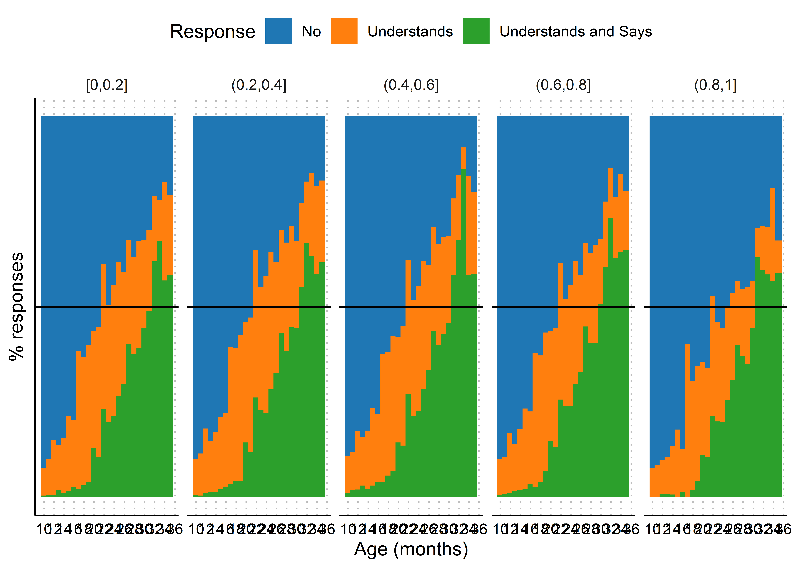{width=3500}
:::
:::


## Model selection

We compared the performance of these models using Bayesian leave-one-out cross-validation (LOO) using the `loo` and `loo_compare` functions of the `brms` R package (dependent of the `LOO` R package). LOO consists in computing the average likelihood of each observation after estimating the model's parameters leave that same observation out of the data set. Although the `loo` function uses a particular algorithm that speeds up the computation of this criterion (pareto-smooth importance sampling, PSIS), the size of our data set lead us to rely on the computation of the same criterion using a sampling approach via de `loo_subsample` function.

::: {.cell}

```{.r .cell-code}
model_loos %>% 
    as_tibble() %>% 
    rownames_to_column("model") %>% 
    relocate(
        model, 
        matches("elpd_loo"),
        matches("p_loo"), 
        matches("looic"), 
        matches("diff")
    ) %>%
    mutate_all(as.numeric) %>% 
    gt() %>% 
    tab_spanner(md("**LOO<sub>ELPD</sub>**"), matches("elpd_loo")) %>% 
    tab_spanner(md("**LOO<sub>p</sub>**"), matches("p_loo")) %>% 
    tab_spanner(md("**LOO<sub>IC</sub>**"), matches("looic")) %>% 
    tab_spanner(md("**LOO<sub>diff</sub>**"), matches("diff")) %>% 
    fmt_number(3:13) %>% 
    cols_label(
        model = "Model",
        # elpd
        elpd_loo = md("*ELPD*"),
        se_elpd_loo = md("*SE*"),
        subsampling_se_elpd_loo = md("*SE<sub>sub</sub>*"),
        # p
        p_loo = md("*p*"),
        se_p_loo = md("SE"),
        subsampling_se_p_loo = md("SE<sub>sub</sub>"),
        # looic
        looic = md("*LOO-IC*"),
        se_looic = md("*SE*"),
        subsampling_se_looic = md("SE<sub>sub</sub>"),
        # diff
        elpd_diff = md("*diff*"),
        se_diff = md("*SE*"),
        subsampling_se_diff = md("*SE<sub>sub</sub>*"),
    ) 
```
:::


## Fixed effects

::: {.cell}

```{.r .cell-code}
str_repl <- c(
    "age_std:doe_std:lv_std" = "Age \u00d7 DoE \u00d7 Levenshtein",
    "age_std:doe_std" = "Age \u00d7 DoE",
    "age_std:lv_std" = "Age \u00d7 Levenshtein",
    "doe_std:lv_std" = "DoE \u00d7 Levenshtein",
    "Intercept" = "Intercept",
    "age_std" = "Age (+1 month)",
    "freq_std" = "Frequency (+1 SD)",
    "n_phon_std" = "# Phonemes (+1 SD)",
    "doe_std" = "DoE (+10%)",
    "lv_std" = "Levenshtein (+1 SD)"
)

draws_fix <- fixef(model_fit_7) %>% 
    as.data.frame() %>%
    rownames_to_column("term") %>% 
    clean_names() %>% 
    select(-est_error) %>% 
    mutate(
        estimate = ifelse(term=="Intercept", inv_logit_scaled(estimate), estimate/4),
        q2_5 = ifelse(term=="Intercept", inv_logit_scaled(q2_5), q2_5/4),
        q97_5 = ifelse(term=="Intercept", inv_logit_scaled(q97_5), q97_5/4),
        term = str_replace_all(term, str_repl)
    )

gt(draws_fix) %>% 
    fmt_percent(2) %>% 
    fmt_number(3:4, decimals = 2) %>% 
    cols_merge(vars("q2_5", "q97_5"), pattern = "[{1}, {2}]") %>% 
    cols_label(
        term = md("**Predictor**"),
        estimate = md("**Mean**"),
        q2_5 = md("**95\\% CrI**"),
    ) %>% 
    tab_footnote(
        footnote = "Transformed using the inverse logit to get the average probability of correct response",
        locations = cells_body(columns = "term", rows = term=="Intercept")
    ) %>% 
    tab_footnote(
        footnote = "Transformed using the divide-by-four- rule to get the maximum change in probability of correct response, associated with a unit increase in this variable.",
        locations = cells_body(columns = "term", rows = term %in% c("Age (+1 month)", "Frequency (+ 1 SD)",  "DoE (+10%)", "Levenshtein (+ 1 SD)", "doe_std:lv_std" = "DoE \u00d7 Levenshtein"))
    ) %>% 
    cols_align(
        align = c("center"),
        columns = 2:3
    )
```

::: {.cell-output-display}
```{=html}
<style>html {
  font-family: -apple-system, BlinkMacSystemFont, 'Segoe UI', Roboto, Oxygen, Ubuntu, Cantarell, 'Helvetica Neue', 'Fira Sans', 'Droid Sans', Arial, sans-serif;
}

#mcdchorncf .gt_table {
  display: table;
  border-collapse: collapse;
  margin-left: auto;
  margin-right: auto;
  color: #333333;
  font-size: 16px;
  font-weight: normal;
  font-style: normal;
  background-color: #FFFFFF;
  width: auto;
  border-top-style: solid;
  border-top-width: 2px;
  border-top-color: #A8A8A8;
  border-right-style: none;
  border-right-width: 2px;
  border-right-color: #D3D3D3;
  border-bottom-style: solid;
  border-bottom-width: 2px;
  border-bottom-color: #A8A8A8;
  border-left-style: none;
  border-left-width: 2px;
  border-left-color: #D3D3D3;
}

#mcdchorncf .gt_heading {
  background-color: #FFFFFF;
  text-align: center;
  border-bottom-color: #FFFFFF;
  border-left-style: none;
  border-left-width: 1px;
  border-left-color: #D3D3D3;
  border-right-style: none;
  border-right-width: 1px;
  border-right-color: #D3D3D3;
}

#mcdchorncf .gt_title {
  color: #333333;
  font-size: 125%;
  font-weight: initial;
  padding-top: 4px;
  padding-bottom: 4px;
  border-bottom-color: #FFFFFF;
  border-bottom-width: 0;
}

#mcdchorncf .gt_subtitle {
  color: #333333;
  font-size: 85%;
  font-weight: initial;
  padding-top: 0;
  padding-bottom: 4px;
  border-top-color: #FFFFFF;
  border-top-width: 0;
}

#mcdchorncf .gt_bottom_border {
  border-bottom-style: solid;
  border-bottom-width: 2px;
  border-bottom-color: #D3D3D3;
}

#mcdchorncf .gt_col_headings {
  border-top-style: solid;
  border-top-width: 2px;
  border-top-color: #D3D3D3;
  border-bottom-style: solid;
  border-bottom-width: 2px;
  border-bottom-color: #D3D3D3;
  border-left-style: none;
  border-left-width: 1px;
  border-left-color: #D3D3D3;
  border-right-style: none;
  border-right-width: 1px;
  border-right-color: #D3D3D3;
}

#mcdchorncf .gt_col_heading {
  color: #333333;
  background-color: #FFFFFF;
  font-size: 100%;
  font-weight: normal;
  text-transform: inherit;
  border-left-style: none;
  border-left-width: 1px;
  border-left-color: #D3D3D3;
  border-right-style: none;
  border-right-width: 1px;
  border-right-color: #D3D3D3;
  vertical-align: bottom;
  padding-top: 5px;
  padding-bottom: 6px;
  padding-left: 5px;
  padding-right: 5px;
  overflow-x: hidden;
}

#mcdchorncf .gt_column_spanner_outer {
  color: #333333;
  background-color: #FFFFFF;
  font-size: 100%;
  font-weight: normal;
  text-transform: inherit;
  padding-top: 0;
  padding-bottom: 0;
  padding-left: 4px;
  padding-right: 4px;
}

#mcdchorncf .gt_column_spanner_outer:first-child {
  padding-left: 0;
}

#mcdchorncf .gt_column_spanner_outer:last-child {
  padding-right: 0;
}

#mcdchorncf .gt_column_spanner {
  border-bottom-style: solid;
  border-bottom-width: 2px;
  border-bottom-color: #D3D3D3;
  vertical-align: bottom;
  padding-top: 5px;
  padding-bottom: 6px;
  overflow-x: hidden;
  display: inline-block;
  width: 100%;
}

#mcdchorncf .gt_group_heading {
  padding: 8px;
  color: #333333;
  background-color: #FFFFFF;
  font-size: 100%;
  font-weight: initial;
  text-transform: inherit;
  border-top-style: solid;
  border-top-width: 2px;
  border-top-color: #D3D3D3;
  border-bottom-style: solid;
  border-bottom-width: 2px;
  border-bottom-color: #D3D3D3;
  border-left-style: none;
  border-left-width: 1px;
  border-left-color: #D3D3D3;
  border-right-style: none;
  border-right-width: 1px;
  border-right-color: #D3D3D3;
  vertical-align: middle;
}

#mcdchorncf .gt_empty_group_heading {
  padding: 0.5px;
  color: #333333;
  background-color: #FFFFFF;
  font-size: 100%;
  font-weight: initial;
  border-top-style: solid;
  border-top-width: 2px;
  border-top-color: #D3D3D3;
  border-bottom-style: solid;
  border-bottom-width: 2px;
  border-bottom-color: #D3D3D3;
  vertical-align: middle;
}

#mcdchorncf .gt_from_md > :first-child {
  margin-top: 0;
}

#mcdchorncf .gt_from_md > :last-child {
  margin-bottom: 0;
}

#mcdchorncf .gt_row {
  padding-top: 8px;
  padding-bottom: 8px;
  padding-left: 5px;
  padding-right: 5px;
  margin: 10px;
  border-top-style: solid;
  border-top-width: 1px;
  border-top-color: #D3D3D3;
  border-left-style: none;
  border-left-width: 1px;
  border-left-color: #D3D3D3;
  border-right-style: none;
  border-right-width: 1px;
  border-right-color: #D3D3D3;
  vertical-align: middle;
  overflow-x: hidden;
}

#mcdchorncf .gt_stub {
  color: #333333;
  background-color: #FFFFFF;
  font-size: 100%;
  font-weight: initial;
  text-transform: inherit;
  border-right-style: solid;
  border-right-width: 2px;
  border-right-color: #D3D3D3;
  padding-left: 12px;
}

#mcdchorncf .gt_summary_row {
  color: #333333;
  background-color: #FFFFFF;
  text-transform: inherit;
  padding-top: 8px;
  padding-bottom: 8px;
  padding-left: 5px;
  padding-right: 5px;
}

#mcdchorncf .gt_first_summary_row {
  padding-top: 8px;
  padding-bottom: 8px;
  padding-left: 5px;
  padding-right: 5px;
  border-top-style: solid;
  border-top-width: 2px;
  border-top-color: #D3D3D3;
}

#mcdchorncf .gt_grand_summary_row {
  color: #333333;
  background-color: #FFFFFF;
  text-transform: inherit;
  padding-top: 8px;
  padding-bottom: 8px;
  padding-left: 5px;
  padding-right: 5px;
}

#mcdchorncf .gt_first_grand_summary_row {
  padding-top: 8px;
  padding-bottom: 8px;
  padding-left: 5px;
  padding-right: 5px;
  border-top-style: double;
  border-top-width: 6px;
  border-top-color: #D3D3D3;
}

#mcdchorncf .gt_striped {
  background-color: rgba(128, 128, 128, 0.05);
}

#mcdchorncf .gt_table_body {
  border-top-style: solid;
  border-top-width: 2px;
  border-top-color: #D3D3D3;
  border-bottom-style: solid;
  border-bottom-width: 2px;
  border-bottom-color: #D3D3D3;
}

#mcdchorncf .gt_footnotes {
  color: #333333;
  background-color: #FFFFFF;
  border-bottom-style: none;
  border-bottom-width: 2px;
  border-bottom-color: #D3D3D3;
  border-left-style: none;
  border-left-width: 2px;
  border-left-color: #D3D3D3;
  border-right-style: none;
  border-right-width: 2px;
  border-right-color: #D3D3D3;
}

#mcdchorncf .gt_footnote {
  margin: 0px;
  font-size: 90%;
  padding: 4px;
}

#mcdchorncf .gt_sourcenotes {
  color: #333333;
  background-color: #FFFFFF;
  border-bottom-style: none;
  border-bottom-width: 2px;
  border-bottom-color: #D3D3D3;
  border-left-style: none;
  border-left-width: 2px;
  border-left-color: #D3D3D3;
  border-right-style: none;
  border-right-width: 2px;
  border-right-color: #D3D3D3;
}

#mcdchorncf .gt_sourcenote {
  font-size: 90%;
  padding: 4px;
}

#mcdchorncf .gt_left {
  text-align: left;
}

#mcdchorncf .gt_center {
  text-align: center;
}

#mcdchorncf .gt_right {
  text-align: right;
  font-variant-numeric: tabular-nums;
}

#mcdchorncf .gt_font_normal {
  font-weight: normal;
}

#mcdchorncf .gt_font_bold {
  font-weight: bold;
}

#mcdchorncf .gt_font_italic {
  font-style: italic;
}

#mcdchorncf .gt_super {
  font-size: 65%;
}

#mcdchorncf .gt_footnote_marks {
  font-style: italic;
  font-size: 65%;
}
</style>
<div id="mcdchorncf" style="overflow-x:auto;overflow-y:auto;width:auto;height:auto;"><table class="gt_table">
  
  <thead class="gt_col_headings">
    <tr>
      <th class="gt_col_heading gt_columns_bottom_border gt_left" rowspan="1" colspan="1"><strong>Predictor</strong></th>
      <th class="gt_col_heading gt_columns_bottom_border gt_center" rowspan="1" colspan="1"><strong>Mean</strong></th>
      <th class="gt_col_heading gt_columns_bottom_border gt_center" rowspan="1" colspan="1"><strong>95% CrI</strong></th>
    </tr>
  </thead>
  <tbody class="gt_table_body">
    <tr>
      <td class="gt_row gt_left">Intercept[1]</td>
      <td class="gt_row gt_center">&minus;21.27&percnt;</td>
      <td class="gt_row gt_center">[&minus;0.24, &minus;0.18]</td>
    </tr>
    <tr>
      <td class="gt_row gt_left">Intercept[2]</td>
      <td class="gt_row gt_center">38.90&percnt;</td>
      <td class="gt_row gt_center">[0.36, 0.42]</td>
    </tr>
    <tr>
      <td class="gt_row gt_left">Age (+1 month)<sup class="gt_footnote_marks">1</sup></td>
      <td class="gt_row gt_center">33.02&percnt;</td>
      <td class="gt_row gt_center">[0.29, 0.37]</td>
    </tr>
    <tr>
      <td class="gt_row gt_left">Frequency (+1 SD)</td>
      <td class="gt_row gt_center">3.95&percnt;</td>
      <td class="gt_row gt_center">[0.02, 0.06]</td>
    </tr>
    <tr>
      <td class="gt_row gt_left"># Phonemes (+1 SD)</td>
      <td class="gt_row gt_center">&minus;5.06&percnt;</td>
      <td class="gt_row gt_center">[&minus;0.07, &minus;0.03]</td>
    </tr>
    <tr>
      <td class="gt_row gt_left">DoE (+10%)<sup class="gt_footnote_marks">1</sup></td>
      <td class="gt_row gt_center">22.31&percnt;</td>
      <td class="gt_row gt_center">[0.22, 0.23]</td>
    </tr>
    <tr>
      <td class="gt_row gt_left">Levenshtein (+1 SD)</td>
      <td class="gt_row gt_center">0.64&percnt;</td>
      <td class="gt_row gt_center">[&minus;0.02, 0.03]</td>
    </tr>
    <tr>
      <td class="gt_row gt_left">DoE × Levenshtein<sup class="gt_footnote_marks">1</sup></td>
      <td class="gt_row gt_center">&minus;5.05&percnt;</td>
      <td class="gt_row gt_center">[&minus;0.05, &minus;0.05]</td>
    </tr>
    <tr>
      <td class="gt_row gt_left">Age × DoE</td>
      <td class="gt_row gt_center">3.16&percnt;</td>
      <td class="gt_row gt_center">[&minus;0.01, 0.07]</td>
    </tr>
    <tr>
      <td class="gt_row gt_left">Age × Levenshtein</td>
      <td class="gt_row gt_center">1.65&percnt;</td>
      <td class="gt_row gt_center">[0.01, 0.03]</td>
    </tr>
    <tr>
      <td class="gt_row gt_left">Age × DoE × Levenshtein</td>
      <td class="gt_row gt_center">&minus;1.42&percnt;</td>
      <td class="gt_row gt_center">[&minus;0.02, &minus;0.01]</td>
    </tr>
  </tbody>
  
  <tfoot>
    <tr class="gt_footnotes">
      <td colspan="3">
        <p class="gt_footnote">
          <sup class="gt_footnote_marks">
            <em>1</em>
          </sup>
           
          Transformed using the divide-by-four- rule to get the maximum change in probability of correct response, associated with a unit increase in this variable.
          <br />
        </p>
      </td>
    </tr>
  </tfoot>
</table></div>
```
:::
:::

<br>


::: {.cell}

```{.r .cell-code}
var_repl <- c(
    "b_Intercept[1]" = "Intercept (Comprehension)",
    "b_Intercept[2]" = "Intercept (Production)",
    "b_age_std:doe_std:lv_std" = "Age \u00d7 DoE \u00d7 Levenshtein", 
    "b_age_std:lv_std" = "Age \u00d7 Levenshtein",
    "b_age_std:doe_std" = "Age \u00d7 DoE",
    "b_doe_std:lv_std" = "DoE \u00d7 Levenshtein", 
    "b_Intercept" = "Intercept", 
    "b_age_std" = "Age (+1 month)", 
    "b_freq_std" = "Frequency (+1 SD)",
    "b_n_phon_std" = "# Phonemes (+1 SD)",
    "b_doe_std" = "DoE (+1 SD)", 
    "b_lv_std" = "Levenshtein (+1 SD)"
)

post <- gather_draws(model_fit_7, `b_.*`, regex = TRUE) %>% 
    mutate(
        .value = ifelse(
            grepl("Intercept|sd", .variable),
            inv_logit_scaled(.value), 
            .value/4
        ),
        .variable_name = factor(
            .variable, 
            levels = names(var_repl),
            labels = var_repl
        )
    )

post_intercept <- post %>% 
    filter(.variable %in% c("b_Intercept[1]", "b_Intercept[2]")) %>% 
    ggplot(aes(.value, .variable_name)) +
    geom_vline(xintercept = 0, size = 0.75, colour = "grey") +
    stat_slab(
        aes(alpha = stat(cut_cdf_qi(cdf, .width = c(.95, .8, .5), labels = percent_format()))),
        size = 0.5,
        color = "#FF0000",
        fill = "#FF0000",
        position = position_nudge(y = 0.2)
    ) +
    stat_pointinterval(point_size = 2) +
    labs(
        x = "Posterior probability of acquisition", 
        y = "Variable", 
        fill = "Variable",
        alpha = "CrI"
    ) +
    scale_alpha_discrete(range = c(1, 0.4), na.translate = FALSE) +
    scale_x_continuous(labels = percent, limits = c(0, 1)) 

post_fix <- post %>% 
    filter(!grepl("Intercept|sd", .variable)) %>% 
    ggplot(aes(.value, .variable_name)) +
    geom_vline(xintercept = 0, size = 0.5, linetype = "dashed") +
    stat_slab(
        aes(alpha = stat(cut_cdf_qi(cdf, .width = c(.95, .8, .5), labels = percent_format()))),
        size = 0.5,
        color = "#00A08A",
        fill = "#00A08A",
        position = position_nudge(y = 0.1)
    ) +
    stat_pointinterval(point_size = 2) +
    labs(
        x = "Posterior probability of acquisition",
        y = "Variable", 
        fill = "Variable",
        alpha = "CrI"
    ) +
    scale_alpha_discrete(range = c(1, 0.4), na.translate = FALSE) +
    scale_x_continuous(labels = percent, breaks = seq(-0.2, 2.5, 0.1)) 


(post_intercept / post_fix) +
    plot_layout(heights = c(0.2, 0.8)) &
    theme(
        legend.position = "top",
        legend.direction = "horizontal",
        legend.justification = "right",
        plot.caption.position = "plot",
        plot.caption = element_text(hjust = 0),
        axis.title.y = element_blank(),
        # axis.text = element_text(size = 7),
        panel.grid.major.x = element_line(colour = "grey", linetype = "dotted"),
        panel.grid.major.y = element_blank()
    )
```

::: {.cell-output-display}
{width=3500}
:::
:::


## Random effects


### Participant

::: {.cell}

```{.r .cell-code}
re_id <- ranef(model_fit_7)$id[,,1] %>% 
    as_tibble() %>% 
    rownames_to_column("id") %>% 
    left_join(distinct(model_fit_7$data, id)) %>% 
    clean_names() %>% 
    mutate(
        across(
            .cols = where(is.numeric),
            .fns = list(
                Comprehension = ~inv_logit_scaled(. + fixef(model_fit_7)[1]),
                Production = ~inv_logit_scaled(. + fixef(model_fit_7)[2])
            ), .names = "{.col}__{.fn}"
        )
    ) %>% 
    select(-c(estimate:q97_5)) %>% 
    pivot_longer(
        where(is.numeric), 
        names_to = c(".value", "type"),
        names_sep = "__"
    ) 

re_id %>% 
    ggplot() +
    aes(
        x = estimate, 
        y = reorder(id, estimate), 
        xmin = q2_5, 
        xmax = q97_5,
        fill = type,
        colour = type
    ) +
    facet_wrap(~type) +
    geom_ribbon(aes(group = 1), alpha = 0.5, color = NA) +
    geom_line(aes(group = 1), size = 1) +
    geom_vline(xintercept = 0.5, colour = "black", linetype = "dotted") +
    labs(
        x = "Posterior probability of acquisition",
        y = "Participant", 
        colour = "Type"
    ) +
    scale_x_continuous(limits = c(0, 1), labels = percent) +
    theme(
        legend.position = "none",
        axis.text.y = element_blank(),
        axis.ticks.y = element_blank(),
        panel.grid = element_line(linetype = "dotted"),
        panel.grid.major.y = element_blank(),
        panel.grid.minor.y = element_blank()
    )
```

::: {.cell-output-display}
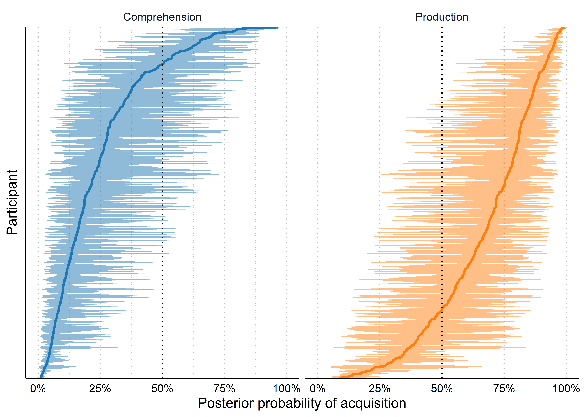{width=3500}
:::
:::

### Item

::: {.cell}

```{.r .cell-code}
re_te <- ranef(model_fit_7)$te[,,1] %>% 
    as_tibble() %>% 
    rownames_to_column("te") %>% 
    clean_names() %>% 
    mutate(
        across(
            .cols = where(is.numeric),
            .fns = list(
                Comprehension = ~inv_logit_scaled(. + fixef(model_fit_7)[1]),
                Production = ~inv_logit_scaled(. + fixef(model_fit_7)[2])
            ), .names = "{.col}__{.fn}"
        )
    ) %>% 
    select(-c(estimate:q97_5)) %>% 
    pivot_longer(
        where(is.numeric), 
        names_to = c(".value", "type"),
        names_sep = "__"
    ) %>% 
    mutate(te = as.numeric(te)) 

re_te %>% 
    ggplot() +
    aes(
        x = estimate, 
        y = reorder(te, estimate), 
        xmin = q2_5,
        xmax = q97_5,
        colour = type,
        fill = type
    ) +
    facet_wrap(~type) +
    geom_ribbon(aes(group = 1), alpha = 0.5, colour = NA) +
    geom_line(aes(group = 1), size = 1) +
    geom_vline(xintercept = 0.5, colour = "black", linetype = "dotted") +
    labs(
        x = "Posterior probability of acquisition",
        y = "TE", 
        colour = "Type"
    ) +
    scale_x_continuous(limits = c(0, 1), labels = percent) +
    theme(
        legend.position = "none",
        axis.text.y = element_blank(),
        axis.ticks.y = element_blank(),
        panel.grid = element_line(linetype = "dotted"),
        panel.grid.major.y = element_blank(),
        panel.grid.minor.y = element_blank()
    )
```

::: {.cell-output-display}
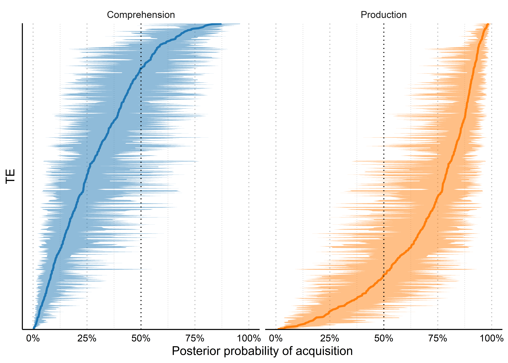{width=3500}
:::
:::


## Marginal means


::: {.cell}

```{.r .cell-code}
nd <- expand.grid(
    n_phon_std = 0,
    freq_std = 0,
    age_std = seq(-4, 4, length.out = 30),
    doe_std = range(df$doe_std),
    lv_std = c(range(df$lv_std), 0)
)

m <- add_epred_draws(nd, model_fit_7, ndraws = 50, re_formula = NA) %>% 
    mutate(
        freq_std = as.factor(paste0("Frequency = ", freq_std, " SD")),
        doe_std = factor(
            doe_std, 
            levels = unique(nd$doe_std), 
            labels = c("DoE: 0%", "DoE: 100%")
        ),
        lv_std = factor(
            lv_std, 
            levels = unique(nd$lv_std)[c(1, 3, 2)],
            labels = c("0%", "50%", "100%")
        )
    ) %>% 
    filter(.category != "No") %>% 
    pivot_wider(names_from = ".category", values_from = ".epred") %>% 
    mutate(Understands = Understands + `Understands and Says`) %>% 
    pivot_longer(
        c(Understands, `Understands and Says`),
        names_to = ".category",
        values_to = ".epred"
    )

ggplot(m, aes(age_std, .epred, colour = lv_std, fill = lv_std)) +
    facet_grid(.category~doe_std) +
    geom_line(
        aes(
            group = interaction(.draw, lv_std, doe_std), 
            colour = lv_std),
        alpha = 0.1, 
        size = 1
    ) +
    # stat_lineribbon(size = 0, alpha = 0.5, .width = 0.95) +
    stat_summary(fun = "mean", geom = "line", size = 1) + 
    geom_hline(yintercept = 0.5, size = 0.5, linetype = "dashed") +
    scale_color_d3() +
    labs(
        x = "Age (months)", 
        y = "Posterior probability of acquisition\n(Linear prediction)",
        colour = "Phonological similarity (Levenshtein distance)", 
        fill = "Phonological similarity (Levenshtein distance)"
    ) +
    scale_y_continuous(labels = percent, limits = c(0, 1)) +
    theme(
        legend.position = "top"
    )
```

::: {.cell-output-display}
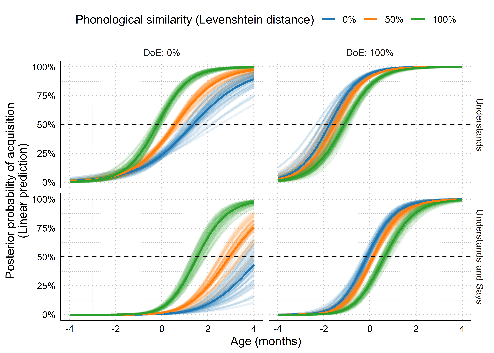{width=3500}
:::
:::


## Model diagnostics

### Traceplots


::: {.cell}

```{.r .cell-code}
gather_draws(
    model_fit_7, 
    `b_.*`, `sd_te__.*`, `cor_te__.*`, 
    regex = TRUE, 
    ndraws = 1000
) %>% 
    mutate(.chain = paste("Chain ", .chain)) %>% 
    ggplot(aes(.iteration, .value, colour = .chain)) +
    facet_wrap(~.variable, scales = "free_y") +
    annotate(
        geom = "rect", 
        colour = NA, 
        xmin = 0,
        xmax = dim(model_fit_7$fit)[1]/2, 
        ymin = -Inf, 
        ymax = Inf, 
        alpha = 0.25, 
    ) +
    geom_line() +
    labs(
        x = "Iteration",
        y = "Sample value",
        colour = "Chain"
    ) +
    scale_color_d3() +
    theme(
        legend.position = "top",
        legend.title = element_blank(),
        panel.grid = element_blank()
    )
```

::: {.cell-output-display}
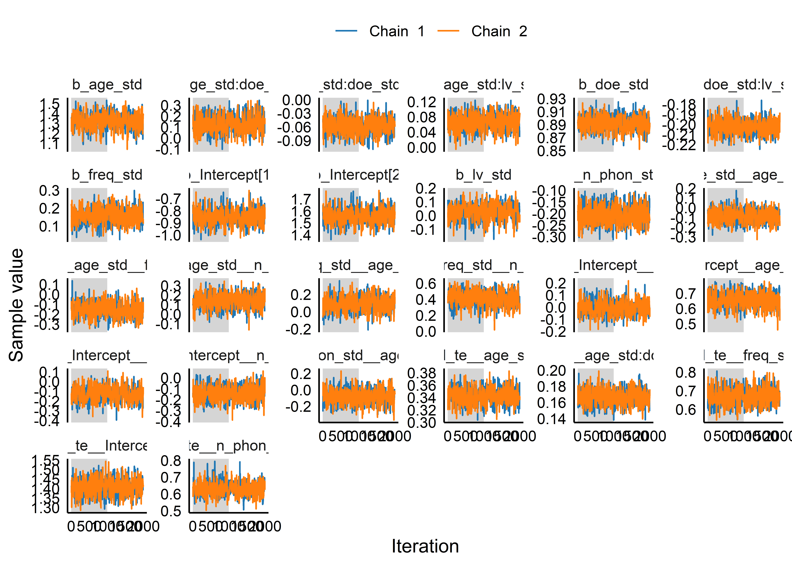{width=3500}
:::
:::

### Gelman-Rubin diagnostic (R-hat)

::: {.cell}

```{.r .cell-code}
mcmc_rhat_data(rhat(model_fit_7)) %>% 
    ggplot() +
    aes(x = value, fill = description, colour = description) +
    geom_histogram(
        bins = 100, 
        na.rm = TRUE, 
        fill = pal_d3()(1)[1], 
        colour = "white"
    ) +
    geom_rug(alpha = 0.1) +
    labs(
        x = "R-hat",
        y = "Number of samples",
        colour = "Description",
        fill = "Description"
    ) +
    theme(
        legend.position = "top"
    )
```

::: {.cell-output-display}
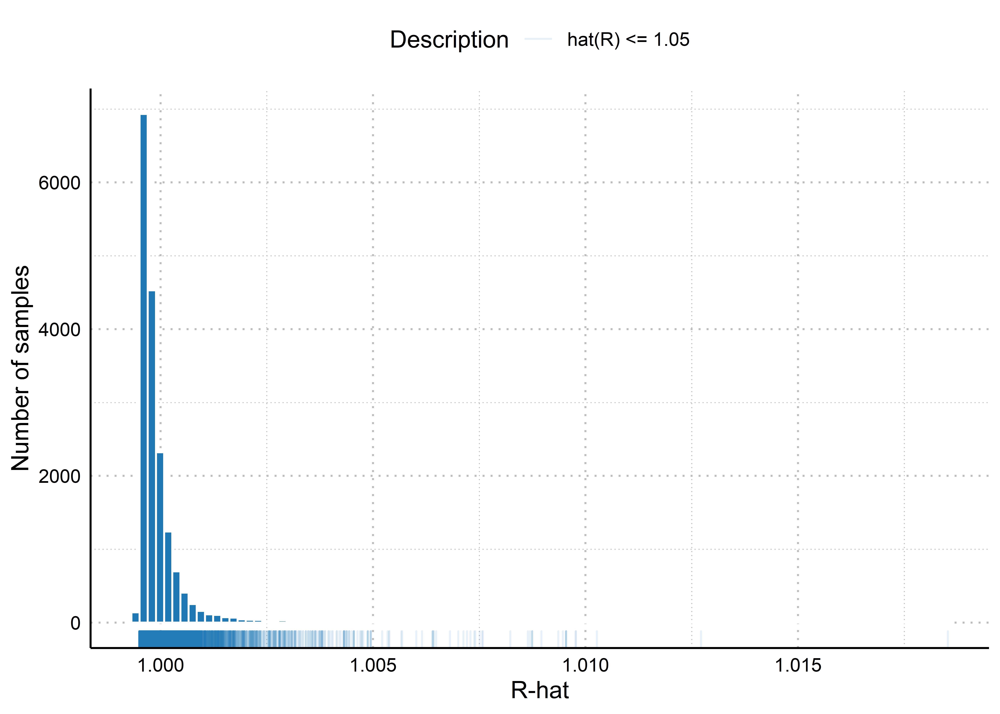{width=3500}
:::
:::

### Effective sample size

::: {.cell}

```{.r .cell-code}
mcmc_neff_data(neff_ratio(model_fit_7)) %>% 
    ggplot() +
    aes(x = value, fill = description, colour = description) +
    geom_histogram(
        bins = 100, 
        na.rm = TRUE, 
        colour = "white"
    ) +
    geom_rug(alpha = 0.01) +
    geom_vline(xintercept = 1, colour = "black", size = 0.75) +
    labs(
        x = "Effective sample size ratio",
        y = "Number of samples",
        colour = "Rating",
        fill = "Rating"
    ) +
    theme(
        legend.position = "top"
    )
```

::: {.cell-output-display}
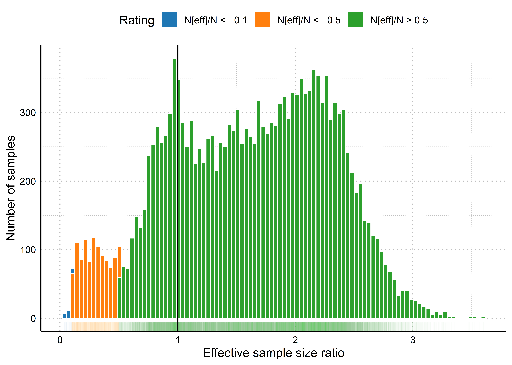{width=3500}
:::
:::


# Appendix

## Session info

::: {.cell}

```{.r .cell-code}
sessionInfo()
```

::: {.cell-output .cell-output-stdout}
```
R version 4.0.5 (2021-03-31)
Platform: x86_64-w64-mingw32/x64 (64-bit)
Running under: Windows 10 x64 (build 19042)

Matrix products: default

locale:
[1] LC_COLLATE=English_United Kingdom.1252 
[2] LC_CTYPE=English_United Kingdom.1252   
[3] LC_MONETARY=English_United Kingdom.1252
[4] LC_NUMERIC=C                           
[5] LC_TIME=English_United Kingdom.1252    

attached base packages:
[1] stats     graphics  grDevices datasets  utils     methods   base     

other attached packages:
 [1] wesanderson_0.3.6 usethis_2.1.6     tidyr_1.1.3       tidybayes_3.0.1  
 [5] tibble_3.1.2      testthat_3.1.4    stringr_1.4.0     stringdist_0.9.8 
 [9] scales_1.1.1      rlang_1.0.4       rmarkdown_2.11.1  readxl_1.3.1     
[13] quarto_1.2        purrr_0.3.4       papaja_0.1.1      tinylabels_0.2.3 
[17] patchwork_1.1.1   multilex_1.0.1    mice_3.13.0       lubridate_1.7.10 
[21] knitr_1.40        keyring_1.2.0     janitor_2.1.0     here_1.0.1       
[25] gt_0.2.2          ggsci_2.9         ggplot2_3.3.5     forcats_0.5.1    
[29] dplyr_1.0.7       conflicted_1.1.0  brms_2.17.0       Rcpp_1.0.6       
[33] bayesplot_1.8.1   arrow_8.0.0       tarchetypes_0.7.0 targets_0.13.1   

loaded via a namespace (and not attached):
  [1] backports_1.2.1      plyr_1.8.6           igraph_1.2.6        
  [4] svUnit_1.0.3         splines_4.0.5        crosstalk_1.1.1     
  [7] rstantools_2.1.1     inline_0.3.19        digest_0.6.27       
 [10] htmltools_0.5.1.1    rsconnect_0.8.27     fansi_0.5.0         
 [13] magrittr_2.0.1       checkmate_2.0.0      memoise_2.0.1       
 [16] base64url_1.4        googlesheets4_0.3.0  RcppParallel_5.1.4  
 [19] matrixStats_0.60.1   xts_0.12.1           prettyunits_1.1.1   
 [22] colorspace_2.0-2     ggdist_3.0.0         rbibutils_2.2.8     
 [25] xfun_0.32            callr_3.7.0          crayon_1.4.1        
 [28] jsonlite_1.7.2       lme4_1.1-27.1        zoo_1.8-9           
 [31] glue_1.6.2           gargle_1.1.0         gtable_0.3.0        
 [34] emmeans_1.6.3        V8_4.2.0             distributional_0.2.2
 [37] pkgbuild_1.3.1       rstan_2.21.2         abind_1.4-5         
 [40] childesr_0.2.1       mvtnorm_1.1-2        DBI_1.1.1           
 [43] miniUI_0.1.1.1       xtable_1.8-4         formr_0.9.1         
 [46] bit_4.0.4            stats4_4.0.5         StanHeaders_2.21.0-7
 [49] DT_0.19              htmlwidgets_1.5.3    threejs_0.3.3       
 [52] arrayhelpers_1.1-0   posterior_1.1.0      ellipsis_0.3.2      
 [55] pkgconfig_2.0.3      loo_2.4.1            farver_2.1.0        
 [58] sass_0.4.0           utf8_1.2.1           labeling_0.4.2      
 [61] tidyselect_1.1.1     reshape2_1.4.4       later_1.2.0         
 [64] cellranger_1.1.0     munsell_0.5.0        tools_4.0.5         
 [67] cachem_1.0.5         cli_3.3.0            generics_0.1.0      
 [70] broom_0.7.8          ggridges_0.5.3       evaluate_0.16       
 [73] fastmap_1.1.0        yaml_2.2.1           processx_3.5.2      
 [76] bit64_4.0.5          fs_1.5.2             nlme_3.1-152        
 [79] mime_0.11            projpred_2.0.2       brio_1.1.3          
 [82] compiler_4.0.5       shinythemes_1.2.0    rstudioapi_0.13     
 [85] curl_4.3.2           gamm4_0.2-6          stringi_1.7.8       
 [88] ps_1.6.0             Brobdingnag_1.2-6    lattice_0.20-41     
 [91] Matrix_1.3-2         commonmark_1.7       nloptr_1.2.2.2      
 [94] markdown_1.1         shinyjs_2.0.0        tensorA_0.36.2      
 [97] vctrs_0.3.8          pillar_1.6.1         lifecycle_1.0.1     
[100] Rdpack_2.3.1         bridgesampling_1.1-2 estimability_1.3    
[103] data.table_1.14.0    httpuv_1.6.1         R6_2.5.0            
[106] promises_1.2.0.1     renv_0.13.2          gridExtra_2.3       
[109] codetools_0.2-18     boot_1.3-27          colourpicker_1.1.0  
[112] MASS_7.3-53          gtools_3.9.2         assertthat_0.2.1    
[115] rprojroot_2.0.2      withr_2.5.0          shinystan_2.5.0     
[118] mgcv_1.8-33          parallel_4.0.5       grid_4.0.5          
[121] coda_0.19-4          minqa_1.2.4          cmdstanr_0.4.0.9000 
[124] snakecase_0.11.0     googledrive_1.0.1    shiny_1.6.0         
[127] base64enc_0.1-3      dygraphs_1.1.1.6    
```
:::
:::


